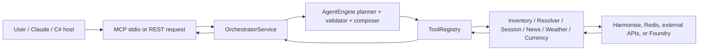

# HTH Stock MCP (v1.0.5)

HTH Stock MCP is a tool-driven inventory layer for the Harmonise catalogue. Users can ask about stock, variants, availability, families, weather, news, and currency in natural language; the runtime routes those questions through validated tools and returns grounded answers with provenance.

[Production Preview](https://app-hth-mcp-dev-ause-01.azurewebsites.net/api/v1/mock-ui)
[MCP API](https://app-hth-mcp-dev-ause-01.azurewebsites.net/mcp)

## Runtime surfaces

- `python3 -m app.mcp.server`: protocol-compliant MCP server over stdio for Claude Code, Cursor, local automation, and other process-based clients.
- `app.main:app`: FastAPI companion app for diagnostics, local smoke tests, and the mock UI.

## System overview

- The runtime sits between upstream systems and Harmonise, which is the authoritative data source.
- SQL-backed inventory systems or ERPs feed Harmonise. This codebase consumes Harmonise and exposes tools to downstream clients.
- C# and browser hosts interact via MCP: launch `python3 -m app.mcp.server` as a child process or speak to a remote HTTP MCP wrapper that reuses the same registry.

## What it does

1. Interpret user intent.
2. Resolve the most likely product or variant.
3. Retrieve Harmonise evidence.
4. Normalize and validate the payload.
5. Respond with concise, grounded answers.

Design principle: retrieve first, validate second, answer last.

## Core stack

- Python 3.11+
- FastAPI for the REST companion surface
- MCP Python SDK for the stdio server
- Pydantic (and Pydantic Settings) for typed contracts and configuration
- httpx and anyio for upstream calls and concurrency
- Redis for session state and tool caches
- Azure AI Foundry for planner, validator, composer, and session naming calls
- Docker for local and cloud packaging
- Harmonise as the authoritative inventory source

## System flow



## Key components

- `app/mcp/server.py`: stdio MCP transport and request translation.
- `app/main.py`: FastAPI companion surface (not an MCP shim).
- `app/orchestrator.py`: session coordination and tool execution.
- `app/agent/engine.py`: planner, retrieval, validator, composer loop for `/api/v1/query`.
- `app/tool/registry.py`: shared catalog for stock, resolver, session, weather, news, and currency behavior.
- `app/tool/stock/source.py`: Harmonise client and retry logic.
- `app/store.py` and `app/session/store.py`: Redis-backed persistence and memo caches.

## Harmonise

This service never queries SQL directly; SQL remains upstream inside the inventory platform that publishes Harmonise endpoints. The integration flow is:

1. SQL stores the source records.
2. Harmonise exposes them via HTTP.
3. This service consumes Harmonise, normalizes the data, and validates it.
4. Claude or another host consumes the runtime via MCP or the REST diagnostics surface.

C# integration patterns:

- Launch `python3 -m app.mcp.server` and speak stdio MCP.
- Or call a remote HTTP MCP gateway that fronts the same registry.

Contract boundary: the JSON schemas in `app/schemas.py` and the tools defined in `app/tool/registry.py`.

## Key capabilities

- Inventory search by name or filter
- Exact product lookup by `id` or `sku`
- Variant evidence extraction with provenance
- Side-by-side variant comparison
- Product-family disambiguation for ambiguous searches
- Session memory and memoization across related calls
- Modular news, weather, and currency lookups

## Local setup

### 1. Create a virtual environment

```bash
python3 -m venv .venv
source .venv/bin/activate
pip install -r requirements.txt
```

### 2. Configure environment variables

Start from `.env.example`. Key values:

- `AZURE_AI_FOUNDRY_ENDPOINT`
- `AZURE_AI_FOUNDRY_API_KEY`
- `HTH_REDIS_URL`
- `LOCAL_HARMONISE` plus either `LOCAL_HARMONISE_ENDPOINT` or `CLOUD_HARMONISE_ENDPOINT`
- `CLOUD_HARMONISE_API` and `CLOUD_HARMONISE_IMAGE` for cloud Harmonise
- `EXCHANGE_RATE_API`, `OPEN_WEATHER_API`, and `NEWS_API` for external plugins

### 3. Run the REST companion app

```bash
uvicorn app.main:app --reload --port 80
```

### 4. Run the stdio MCP server

```bash
python3 -m app.mcp.server
```

### 5. Optional local Harmonise simulator

```bash
uvicorn harmonise.main:app --reload --port 9000
```

## Docker

The provided `Dockerfile` builds the REST companion app.

```bash
docker build -t hth-stock-intelligence .
docker run --rm -p 80:80 --env-file .env hth-stock-intelligence
```

Use `python3 -m app.mcp.server` as the container entrypoint to run the stdio MCP server instead of the REST app.

## Diagnostics

### Health

```bash
curl http://localhost:80/api/v1/health
```

### Tool catalog

```bash
curl http://localhost:80/api/v1/tools
```

### Direct tool call

```bash
curl -X POST http://localhost:80/api/v1/tools/call   -H "Content-Type: application/json"   -d '{
    "tool": "stock.search_catalogue",
    "args": {
      "page": 1,
      "pageSize": 5,
      "search": "white gloss dance floor"
    }
  }'
```

### Query demo

`POST /api/v1/query` runs the planner/validator/composer loop and returns answers plus optional debug payloads.

## MCP integration

The repo includes a local `.mcp.json` example for process-based MCP clients (Claude Code, Cursor, etc.).

Claude.ai requires a public HTTPS MCP endpoint, so the stdio server is not directly attachable. Follow `docs/phase2/mcp.md` for Azure deployments that expose `/mcp`, trust forwarded HTTPS headers, and enable the OAuth bridge for browser connectors.

For Claude.ai browser connectors, configure `HTH_MCP_BEARER_TOKEN` and keep `HTH_MCP_OAUTH_ENABLED=true` in your deployment settings. The app now keeps the OAuth bridge available whenever a bearer token is present, which avoids the common "protected resource discovered but auth endpoints are missing" failure mode.

## Tests

```bash
pytest
```

Covered areas:

- REST health, query, and tool execution
- stdio MCP initialize, list_tools, and call_tool flows
- Tool validation and structured error responses
- Inventory normalization, cache behavior, and fallback handling

## Important files

- `app/main.py` (REST diagnostics and mock UI)
- `app/mcp/server.py` (stdio MCP transport)
- `app/mcp/adapter.py` (MCP schema/result translation)
- `app/tool/registry.py` (tool catalog)
- `app/tool/stock/source.py` (Harmonise transport and retries)
- `app/agent/engine.py` (planner, retrieval, validation, composition)
- `app/session/store.py` and `app/store.py` (Redis-backed persistence)
