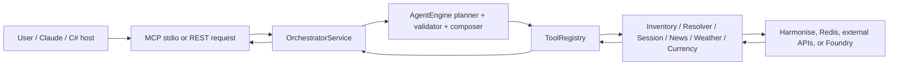

# HTH Stock MCP (v1.0.5)

HTH Stock MCP is a tool-driven inventory layer for the Harmonise catalogue. Users can ask about stock, variants, availability, families, weather, news, and currency in natural language; the runtime routes those questions through validated tools and returns grounded answers with provenance.

[Production Preview](https://app-hth-mcp-dev-ause-01.azurewebsites.net/api/v1/chat)
[MCP API](https://app-hth-mcp-dev-ause-01.azurewebsites.net/mcp)

## Runtime surfaces

- `python3 -m app.mcp.server`: protocol-compliant MCP server over stdio for Claude Code, Cursor, local automation, and other process-based clients.
- `app.main:app`: FastAPI companion app for diagnostics, local smoke tests, and the mock UI.

## System overview

- The runtime sits between upstream systems and Harmonise, which is the authoritative data source.
- SQL-backed inventory systems or ERPs feed Harmonise. This codebase consumes Harmonise and exposes tools to downstream clients.
- C# and browser hosts interact via MCP: launch `python3 -m app.mcp.server` as a child process or speak to a remote HTTP MCP wrapper that reuses the same registry.

## What it does

1. Interpret user intent.
2. Resolve the most likely product or variant.
3. Retrieve Harmonise evidence.
4. Normalize and validate the payload.
5. Respond with concise, grounded answers.

Design principle: retrieve first, validate second, answer last.

## Core stack

- Python 3.11+
- FastAPI for the REST companion surface
- MCP Python SDK for the stdio server
- Pydantic (and Pydantic Settings) for typed contracts and configuration
- httpx and anyio for upstream calls and concurrency
- Redis for session state and tool caches
- Azure AI Foundry for planner, validator, composer, and session naming calls
- Docker for local and cloud packaging
- Harmonise as the authoritative inventory source

## System flow



## Key components

- `app/mcp/server.py`: stdio MCP transport and request translation.
- `app/main.py`: FastAPI companion surface (not an MCP shim).
- `app/orchestrator.py`: session coordination and tool execution.
- `app/agent/engine.py`: planner, retrieval, validator, composer loop for `/api/v1/query`.
- `app/tool/registry.py`: shared catalog for stock, resolver, session, weather, news, and currency behavior.
- `app/tool/stock/source.py`: Harmonise client and retry logic.
- `app/store.py` and `app/session/store.py`: Redis-backed persistence and memo caches.

## Harmonise

This service never queries SQL directly; SQL remains upstream inside the inventory platform that publishes Harmonise endpoints. The integration flow is:

1. SQL stores the source records.
2. Harmonise exposes them via HTTP.
3. This service consumes Harmonise, normalizes the data, and validates it.
4. Claude or another host consumes the runtime via MCP or the REST diagnostics surface.

C# integration patterns:

- Launch `python3 -m app.mcp.server` and speak stdio MCP.
- Or call a remote HTTP MCP gateway that fronts the same registry.

Contract boundary: the JSON schemas in `app/schemas.py` and the tools defined in `app/tool/registry.py`.

## Key capabilities

- Inventory search by name or filter
- Exact product lookup by `id` or `sku`
- Variant evidence extraction with provenance
- Side-by-side variant comparison
- Product-family disambiguation for ambiguous searches
- Session memory and memoization across related calls
- Modular news, weather, and currency lookups

## MCP tool catalog

Claude.ai and other MCP clients should treat the tool registry as a curated, policy-guided workflow. Every entry below is implemented in `app/tool/registry.py` and exposed via the stdio or REST companions. Use the visible tools for normal comprehension flows and rely on the hidden metadata/administrative helpers only when explicitly requested. Each tool’s schema is available from the registry via `/api/v1/tools`, and the same payloads power MCP `list_tools` + `call_tool`.

### Stock tools

This category surfaces Harmonise-backed inventory discovery, product/family detail, category resolution, and scoped insights. Inputs generally accept `search`, `departmentId`, `categoryId`, and paging/filter hints, and responses include normalized inventory evidence plus optional coverage/guidance metadata (`app/tool/registry.py`, lines 186‑733).

- **`stock_scope`**
  - **Purpose:** Returns the supported departments, category routes, and filter IDs so other stock tools know which scopes are valid. It also embeds usage guidance (`furniture_capability_summary`).
  - **Arguments:** None (aside from session context) but the response includes `departmentId`, `categoryId`, `mapped_furniture_category_count`, and routing hints.
  - **Example input:** `{}`.
  - **Example output:** 
    ```json
    {
      "departments": [...],
      "category_routes": [...],
      "filters": {...},
      "guidance": {
        "purpose": "...",
        "live_inventory": "..."
      }
    }
    ```

- **`stock_list_category`**
  - **Purpose:** Resolves broad furniture phrases like `coffee tables`, `stools`, or `ottomans` to the canonical supported `categoryId` values before a product or inventory search.
  - **Arguments:** `query`, optional `departmentId`, `limit`.
  - **Example input:** `{"query": "coffee tables"}`.
  - **Example output:** `{"query": "...", "status": "matched", "matches": [...]}` where each match includes `categoryId`, `name`, `departmentId`, `description`, `confidence`, and `matchedOn`.

- **`stock_search`**
  - **Purpose:** Finds families/products matching keywords, departments, and categories. Good starting point for ambiguous requests. The backend automatically pages through the catalogue in capped batches, so callers do not control `pageSize`.
  - **Arguments:** `search`, `departmentId`, `categoryId`, `page`.
  - **Example input:** `{"search": "white gloss dance floor", "page": 1}`.
  - **Example output:** Aggregated catalogue response with `items` (each has `id`, `name`, `departmentId`, and variants), `page`, fixed backend `pageSize`, `totalCount`, and `totalPages`.

- **`stock_detail`**
  - **Purpose:** Once an exact SKU or product ID is known, this returns the family plus full variant list (dimensions, pricing`, `stock` per state).
  - **Arguments:** `id` or `sku`.
  - **Example input:** `{"sku": "ALTO-CH-001"}`.
  - **Example output:** Product detail similar to the search result but with every variant’s `details` (height, width, stock, image URLs) and `llm_content` tailored for summaries.

- **`stock_snapshot`**
  - **Purpose:** Produces answer-ready snapshot rows for broad catalogue/category inquiries, including `knownSpecs`, `stock`, and `attributeEvidence`.
  - **Arguments:** `search`, `departmentId`, `categoryId`, etc., with controls for `includeKnownSpecs`.
  - **Example output:** `{"rows": [...], "coverage": {...}, "evidence": [...]}` where `rows` already include `stock`, `knownSpecs`, and `attributeEvidence` for downstream summarization.

- **`stock_aggregate`**
  - **Purpose:** Sums stock or hirable counts across all resolved inventory rows and ranks grouped totals. Use for “most/least by type/family/category/state/all inventory” questions.
  - **Arguments:** `search`, `region`, `measure`, `groupBy`, `direction`, `limit`, optional `departmentId`/`categoryId`.
  - **Example input:** `{"search": "chair", "region": "NSW", "measure": "stock", "groupBy": "product", "direction": "most"}`.
  - **Example output:** Ranked groups with `rankValue`, summed `stock`/`hirable` totals, contributing variants, and coverage notes.

- **`stock_specs_rank`**
  - **Purpose:** Ranks resolved products or variants by stock, hirable, dimensions, derived area/volume, or pricing metrics. Use for complex stock/spec ranking rather than grouped totals.
  - **Arguments:** `search`, `metric`, `groupBy`, `region`, `direction`, `attributeFilters`, `limit`, optional department/category-based filters.
  - **Example input:** `{"search": "Charlie chair", "metric": "cost", "groupBy": "variant", "region": "VIC", "direction": "most"}`.
  - **Example output:** Ranked rows with `rankValue`, contributing variants, pricing/dimension evidence, and coverage/guidance.

- **`stock_variant_rank`**
  - **Purpose:** Ranks resolved variants within a named family by stock, hirable, dimensions, derived area/volume, or pricing metrics. Use only for intra-family variant/SKU ranking, not grouped type totals.
  - **Arguments:** `search`, `metric`, `region`, `direction`, `attributeFilters`, `limit`, optional department/category-based filters.
  - **Example input:** `{"search": "Charlie chair", "metric": "stock", "region": "VIC", "direction": "most"}`.
  - **Example output:** Variant-ranked rows with `groupBy="variant"`, `rankValue`, dimensions/pricing/media, and coverage/guidance.

- **`stock_image`**
  - **Purpose:** Resolves a Harmonise product image from an exact image path, exact SKU, or product-family search, then returns the HTTP image URL plus MCP-native image content when rendering succeeds.
  - **Arguments:** `imageFileName`, `sku`, or `search`, plus optional `departmentId`, `categoryId`, `page`.
  - **Example input:** `{"sku": "fl-la-la-lam-1-gre"}`.
  - **Example output:** `{"source": "sku", "imageFileName": "...", "imageUrl": "...", "coverage": {...}}` plus inline MCP image content when fetch succeeds.

- **`stock_compare`**
  - **Purpose:** Side-by-side comparison of 2‑20 SKUs. Each row includes state stock, pricing, media, and coverage.
  - **Arguments:** `identifiers` list (SKUs or IDs).
  - **Example input:** `{"identifiers": ["CHARLIE-CH-001", "CHARLIE-CH-002"], "regions": ["VIC","NSW"]}` (regions used for guidance).
  - **Example output:** `{"data": [{"sku": "...", "vicStock": 5, "nswStock": 10,...}, ...]}` plus `llm_content`.

Hidden stock tools (local Harmonise only or backwards-compatible aliases):
  - `stock_get_departments` and `stock_get_categories` (`visible=False`) expose raw metadata for local Harmonise dev environments.
  - Old names such as `stock_inventory_snapshot`, `stock_get_product_family_inventory`, `stock_count_items`, and `stock_hirable_by_state` remain callable but hidden.
  - `stock_get_variant_evidence` and `stock_extract_variant_evidence` remain hidden exact-variant evidence helpers.

### Resolver tools

- **`stock_list_category`**
  - **Purpose:** Resolves broad furniture phrases to the canonical supported `categoryId` values before a product or inventory search.
  - **Arguments:** `query`, optional `departmentId`, `limit`.
  - **Example input:** `{"query": "coffee tables"}`.
  - **Example output:** `{"query": "...", "status": "matched", "matches": [...]}` where each match includes `categoryId`, `name`, `departmentId`, `description`, `confidence`, and `matchedOn`.

- **`stock_disambiguate`**
  - **Purpose:** Ranks ambiguous catalogue candidates and optionally returns a resolved family or clarification options for follow-up questions.
  - **Arguments:** `query`, optional `departmentId`, `categoryId`, `limit`.
  - **Example output:** Either `{"status": "resolved_product_family", "product_id": "...", "variant_count": ...}` when confident, or a clarification payload with several `options`.

### Session tools

- **`session_state`**
  - **Purpose:** Returns the MCP session working memory (recent identifiers, plan, memo, conversation summary). Use only when the user explicitly asks about context/history.
  - **Arguments:** `sessionId` (or relies on the MCP session context).
  - **Example output:** Summary payload with `recent_product_names`, `plan`, `memo`, and `conversation` text plus structured details.

- **`session_clear_state`** (hidden administrative tool)
  - **Purpose:** Clears stored session memory; used in diagnostics or to reset a conversation.
  - **Arguments:** `sessionId`.
  - **Visibility:** Hidden from MCP discovery to prevent accidental use.

### News tools

These call NewsAPI via `app/tool/news.py` and include formatted summaries:

- **`news_search`**
  - **Purpose:** Keyword or source-based news search with pagination, date filters, and language options.
  - **Example input:** `{"query": "furniture supply chain", "page": 1}`.
  - **Example output:** API articles plus `llm_content` of formatted summaries (`format_news_articles`).

- **`news_headlines`**
  - **Purpose:** Top headlines by country/category/source; returns articles and formatted summaries.
  - **Example output:** `{"articles": [...], "llm_content": [formatted summaries]}`.

- **`news_sources`**
  - **Purpose:** Lists available NewsAPI sources by category/language/country to seed future searches.
  - **Example output:** `{"sources": [{"id": "...", "name": "..."}]}`.

### Weather tools

OpenWeather-powered helpers defined near `app/tool/weather.py`:

- **`weather_current`** — current conditions for the resolved place.
- **`weather_forecast`** — 5-day/3-hour forecast data.
- **`weather_history`** — historical data when supported.
Each visible weather tool accepts `q`/`lat`/`lon` plus date bounds where applicable, returns the OpenWeather payload, and attaches normalization notes for traceability. `weather_resolve` remains hidden for geocoding-only diagnostics.

### Currency tools

These wrap `app/tool/currency.py`/`CurrencyService` and hit exchangeratesapi:

- **`fx_symbols`** — lists supported ISO currency codes.
- **`fx_latest`** — latest FX rates for optional base/targets.
- **`fx_history`** — single-date historical FX rates.
- **`fx_series`** — time series between `start_date` and `end_date`.
- **`fx_convert`** — convert an amount between currencies on an optional date.
- **`fx_fluctuation`** — compares start/end rates over a date range.

All FX tools share the same pattern: validated args, normalized data/notes, and traces for auditing. The old `currency_*` names remain hidden aliases.

The raw local metadata tools and deprecated aliases remain callable for compatibility but are hidden from normal MCP discovery so external models do not choose them by accident.

Example Claude.ai tool routing:

- “How many department and category of stock do we have?” -> `stock_scope`.
- “Show me stools” -> `stock_list_category` first, then `stock_snapshot` or `stock_search` with the returned `categoryId`.
- “Let me know about our Alto chair stock availability.” -> `stock_snapshot` with `search="Alto chair"` and `departmentId=3`, then summarize every variant.
- “Which type of chair has the most stock in NSW production-wise?” -> `stock_aggregate` with prompt-supplied `search`, `region="NSW"`, `measure="stock"`, `groupBy="product"`, and `direction="most"`. The backend caps page size at 50 and paginates through the full matching catalogue automatically.
- “Which Charlie chair variant is most in stock in Victoria?” -> `stock_variant_rank` with `search="Charlie chair"`, `metric="stock"`, `region="VIC"`, and `direction="most"`.

## Local setup

### 1. Create a virtual environment

```bash
python3 -m venv .venv
source .venv/bin/activate
pip install -r requirements.txt
```

### 2. Configure environment variables

Start from `.env.example`. Key values:

- `AZURE_AI_FOUNDRY_ENDPOINT`
- `AZURE_AI_FOUNDRY_API_KEY`
- `HTH_REDIS_URL`
- `LOCAL_HARMONISE` plus either `LOCAL_HARMONISE_ENDPOINT` or `CLOUD_HARMONISE_ENDPOINT`
- `CLOUD_HARMONISE_API` and `CLOUD_HARMONISE_IMAGE` for cloud Harmonise
- `MAX_CAP_VARIANT` to cap per-family variant spec enrichment before prompting for a narrower follow-up (default `20`)
- `EXCHANGE_RATE_API`, `OPEN_WEATHER_API`, and `NEWS_API` for external plugins

### 3. Run the REST companion app

```bash
uvicorn app.main:app --reload --port 80
```

### 4. Run the stdio MCP server

```bash
python3 -m app.mcp.server
```

### 5. Optional local Harmonise simulator

```bash
uvicorn harmonise.main:app --reload --port 9000
```

## Docker

The provided `Dockerfile` builds the REST companion app.

```bash
docker build -t hth-stock-intelligence .
docker run --rm -p 80:80 --env-file .env hth-stock-intelligence
```

Use `python3 -m app.mcp.server` as the container entrypoint to run the stdio MCP server instead of the REST app.

## Diagnostics

### Health

```bash
curl http://localhost:80/api/v1/health
```

### Tool catalog

```bash
curl http://localhost:80/api/v1/tools
```

### Direct tool call

```bash
curl -X POST http://localhost:80/api/v1/tools/call   -H "Content-Type: application/json"   -d '{
    "tool": "stock_search",
    "args": {
      "page": 1,
      "search": "white gloss dance floor"
    }
  }'
```

### Query demo

`POST /api/v1/query` runs the planner/validator/composer loop and returns answers plus optional debug payloads.

## MCP integration

The repo includes a local `.mcp.json` example for process-based MCP clients (Claude Code, Cursor, etc.).

Claude.ai requires a public HTTPS MCP endpoint, so the stdio server is not directly attachable. Follow `docs/phase2/mcp.md` for Azure deployments that expose `/mcp`, trust forwarded HTTPS headers, and enable the OAuth bridge for browser connectors.

For connector-style OAuth setup, configure `HTH_MCP_BEARER_TOKEN`. That keeps the OAuth bridge available and exposes the registration, authorize, and token endpoints that GPT, Cursor, and Claude.ai expect. The project uses the manual/DCR path for client registration, so the connector should read the `client_id` and `client_secret` returned by `POST /oauth/register`. The bridge now returns a JWT access token, signed by `HTH_MCP_OAUTH_JWT_SECRET` when set or `HTH_MCP_BEARER_TOKEN` as a fallback.

If you trust public connectors from ChatGPT or Claude, set `AUTO_TRUSTED_DOMAINS=chatgpt.com,claude.ai,claude.com` so those hosts can auto-register without a manual pre-registration step. Also allow the same browser origins in `HTH_MCP_ALLOWED_ORIGINS` when you want cross-origin discovery and OAuth responses to work from hosted connector UIs.

OAuth recovery rule of thumb:

1. `POST /oauth/register`
2. Save `client_id`, `client_secret`, `registration_client_uri`, and `registration_access_token`
3. If you ever lose the values, call `GET /oauth/register/{client_id}` with the registration access token
4. If identity validation is enabled, use the JWT access token returned by `/oauth/token` when calling `/mcp`

Identity enforcement is separate from the OAuth bridge. Read `docs/phase2/auth.md` for the Entra/JWT resource-server rules and `docs/phase2/oauth.md` for the connector registration flow. The optional `OAUTH_*` settings are only for the separate direct Entra login helper endpoints and are not required for standard MCP connector OAuth.

## Tests

Stock-related tests (`tests/test_app.py`, `tests/test_mcp.py`, `tests/test_engine.py`, and others) **do not** force the in-process Harmonise simulator. They use Harmonise settings from the repo `.env` at the project root. Set `LOCAL_HARMONISE=false` and point `CLOUD_HARMONISE_ENDPOINT` (for example `https://ase-backend-sales-dev-australiasoutheast.azurewebsites.net`) plus `CLOUD_HARMONISE_API` before running pytest so catalogue and snapshot assertions hit the same backend as your deployment.

```bash
pytest
```

Covered areas:

- REST health, query, and tool execution
- stdio MCP initialize, list_tools, and call_tool flows
- Tool validation and structured error responses
- Inventory normalization, cache behavior, and fallback handling

## Harmonise Product API debugs:

Navigate to [Harmonise AS](https://portal.azure.com/#@harrythehirer.com.au/resource/subscriptions/db0ada2c-ba7c-4171-987d-e8645fef57ba/resourceGroups/Harmonise-Sales-dev/providers/Microsoft.Insights/components/appi-shared-Sales-dev-australiasoutheast/logs). 

Preview Monitoring/Logs -> KQL mode -> Run:
```sql
requests 
| where
1==1
and name startswith "GET api/v1/products"
and timestamp > ago(10m)
| order by timestamp desc
| extend 
duration,
performanceBucket
```

Focus View:
```sql
requests 
| where name startswith "GET api/v1/products"
| where timestamp > ago(10m)
| order by timestamp desc
| project id, name, url, resultCode, timestamp
```

To list error request:
```sql
requests  
| where name startswith "GET api/v1/products"
| where toint(resultCode) >= 500
| order by timestamp desc
| project timestamp, name, resultCode, duration, performanceBucket
```

> Review `duration`, `resultCode` and carried parameters + frequencies a user hit.
