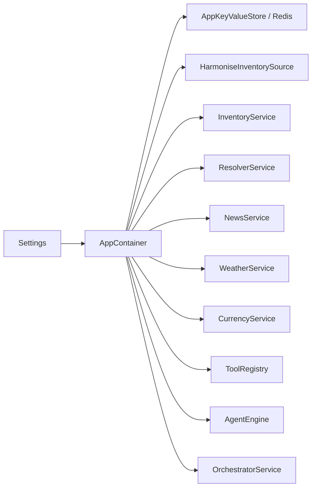

# Technical Specification

## 1. Audience and scope

This is for engineers and IT staff who run, extend, or deploy the service. It describes the production code, runtime boundaries, and integration contracts.

## 2. Runtime architecture

A shared container wires settings, stores, services, the orchestrator, and the agent engine.



Business logic lives in service classes (not transports). Key modules:

- `app/mcp/server.py`: stdio MCP transport
- `app/main.py`: FastAPI REST companion surface
- `app/tool/registry.py`: tool registration
- `app/orchestrator.py`: session coordination and tool execution
- `app/agent/engine.py`: planner → retrieval → validator → composer loop

## 3. Environment setup

### Python

```
python3 -m venv .venv
source .venv/bin/activate
pip install -r requirements.txt
```

### Docker

The `Dockerfile` builds the REST companion app. Use it for diagnostics and local deployments.

```
docker build -t hth-stock-intelligence .
```

To containerize the stdio MCP surface, start the image with `python3 -m app.mcp.server`.

### C# interop

- Launch `python3 -m app.mcp.server` and speak stdio MCP.
- Or proxy calls through a remote HTTP MCP wrapper that uses the shared container.

Contract boundary: `app/schemas.py` and the tools in `app/tool/registry.py`.

## 4. Configuration

Settings live in `app/config/settings.py` and load from environment variables or `.env`.

### Required variables

- `AZURE_AI_FOUNDRY_ENDPOINT`, `AZURE_AI_FOUNDRY_API_KEY`, `AZURE_AI_FOUNDRY_MODEL`
- `HTH_REDIS_URL`
- `LOCAL_HARMONISE`
- `LOCAL_HARMONISE_ENDPOINT` or `CLOUD_HARMONISE_ENDPOINT`
- `CLOUD_HARMONISE_API`, `CLOUD_HARMONISE_IMAGE`
- `EXCHANGE_RATE_API`, `OPEN_WEATHER_API`, `NEWS_API`

### Operational toggles

- `HTH_REDIS_FALLBACK_ENABLED`
- `HTH_LOCAL_CHAT_MEMORY_ENABLED`
- `HTH_AGENT_MAX_STEPS`
- `HTH_STOCK_PARALLEL_REQUESTS_LIMIT`
- `HTH_SNAPSHOT_EXPAND_MAX_INITIAL_ITEMS`
- `HTH_SNAPSHOT_SPECIFICITY_THRESHOLD`

## 5. Persistence and logical schema

Redis stores working state while Harmonise is the authoritative source.

### Redis namespaces

- `session:*`: session state
- `tool:*`: cached tool responses

### Logical inventory model

- `department` 1→N `sub_department`
- `department` 1→N `product`
- `category` self-referential parent/child
- `product` 1→N `variant`
- `variant` 1→1 `variant_detail`
- `product` 1→N `variation`
- `variation` 1→N `option`
- `variant` N→M `option` via `optionIds`

### Data-driven flow

1. SQL stores authoritative records.
2. Harmonise exposes them via HTTP.
3. `HarmoniseInventorySource` reads the API.
4. `InventoryService` normalizes the payload and caches it.
5. `ToolRegistry` publishes typed tools for callers.

## 6. Transport surfaces

### MCP stdio

- `app/mcp/server.py` exposes a real MCP server over stdio.
- `list_tools()` loads the catalog from the shared registry.
- `call_tool()` forwards requests through the orchestrator.
- Session identifiers derive from the MCP request context when possible.

Use stdio MCP for local desktop clients and process-based integrations.

### REST companion API

`app/main.py` exposes:

- `/api/v1/health`
- `/api/v1/system/spec`
- `/api/v1/tools`
- `/api/v1/tools/call`
- `/api/v1/query`
- `/api/v1/ui`

This surface is for diagnostics and mock UI behavior, not a replacement for MCP.

## 7. Tool architecture

The registry is the single source of truth for tool definitions.

### Stock tools

- `stock_get_departments`
- `stock_get_categories`
- `stock_search_catalogue`
- `stock_get_product`
- `stock_extract_variant_evidence`
- `stock_get_variant_evidence`
- `stock_compare_variants`
- `stock_inventory_snapshot`

### Shared tools

- `resolver_disambiguate_candidates`
- `session_get_state`
- `session_clear_state`

### External plugin tools

- `news_search`, `news_headlines`, `news_sources`
- `weather_resolve`, `weather_current`, `weather_forecast`, `weather_history`
- `currency_symbols`, `currency_latest`, `currency_history`, `currency_timeseries`, `currency_convert`, `currency_fluctuation`

### Tool contract behavior

The registry validates tool arguments with Pydantic before execution and returns typed `ToolResult` objects that include normalized data, trace metadata, memo updates, validation details, and optional plain-language content.

## 8. Harmonise source integration

`app/tool/stock/source.py` is the only module that speaks to Harmonise.

- Local mode (`LOCAL_HARMONISE=true`): uses the in-process Harmonise simulator.
- Cloud mode (`LOCAL_HARMONISE=false`): calls the cloud Harmonise endpoint with the configured API key header.

Contract overrides:

- `search_catalogue` prefers the cloud `/api/v1/products` route and falls back to the legacy local stock route.
- `get_product` by `id` is emulated in cloud mode because the cloud contract treats `id`/`sku` differently.
- Metadata endpoints (departments, categories) are only available in local mode.

Some tools are hidden in cloud mode to reflect the actual upstream contract.

## 9. Stock normalization

`InventoryService` transforms raw Harmonise payloads into answer-ready evidence.

### Normalized evidence

`NormalizedEvidence` includes:

- product and variant identifiers
- variation options
- pricing, dimensions, stock, lifecycle
- media, component allocations, provenance
- field-to-source-path mappings

Provenance ensures downstream code knows where each normalized value came from.

### Snapshot rendering

Snapshot rows render as business-friendly sentences (e.g., “Overall has X in stock”) instead of telemetry key/value fragments.

### Snapshot expansion

For broad catalogue questions, the service:

- estimates whether the initial match is too narrow
- broadens the scan by department when confidence is low
- iterates remaining pages when necessary
- dedupes products before normalization

That keeps large answers complete without burdening the model with many small calls.

## 10. Resolver ranking and clarification

The resolver ranks candidate products/variants when a query matches multiple items.

### Scoring model

Confidence combines:

- exact product name matches
- exact variant name matches
- exact SKU matches
- lexical overlap between query and candidate text
- fuzzy string ratio
- token coverage
- variation option alignment

Scores cap below 1.0 and live in `CandidateOption.confidence`.

### Clarification thresholds

- Return clarification when one result exists but confidence is low.
- Return clarification when multiple results exist and the top result is not dominant.
- Small sets return selectable options; large sets ask the user to refine the query and provide hints.

This “pedigree ranking” balances relevance, evidence quality, and ambiguity detection.

## 11. Override and recovery systems

- Session and args recovery: if a planned tool call lacks identifiers, the engine pulls them from session evidence before asking the user.
- Recursive follow-up overrides: when catalogue results lack enough detail, the engine inserts a retrieval step to resolve identifiers first.
- Resolver follow-up overrides: when a product family is confirmed, schedule a detail hop so answers cover all variants.
- Cloud contract overrides: hide local metadata endpoints, emulate exact product lookup, and treat legacy routes as fallbacks.
- Fallback overrides: if composition fails, the runtime either synthesizes a grounded answer with the model or returns the inventory snapshot directly.

The system favors grounded responses over empty ones.

## 12. Agent pipeline

The query runtime is a four-stage loop:

1. Planner: generates a structured plan with steps, dependencies, and memo state.
2. Retrieval: executes tool calls (possibly in parallel) and caches results in the memo.
3. Validator: checks row counts, ambiguity, missing statistics, and confidence. If Foundry is unavailable, fall back to deterministic normalization.
4. Composer: turns grounded evidence into the final response. If it fails, return the grounded draft instead of discarding the work.

## 13. Testing and validation

Run tests with `python3`:

```
pytest
```

Recommended targets:

- `tests/test_app.py` (REST flows)
- `tests/test_mcp.py` (stdio MCP behavior)
- `tests/test_inventory_cloud.py` (Harmonise contract behavior)
- `tests/test_engine.py` (planner and composer flows)
- `tests/test_resolver.py` (clarification ranking)

## 14. Practical contribution notes

- Keep transport code thin; add business logic in services.
- Preserve provenance on normalized results.
- Reuse the existing registry and shared container.
- Do not duplicate tool definitions across MCP and REST.
- When adding a new tool family: start in `app/tool/registry.py`, implement the backing service, and wire it into the agent prompts if needed.
