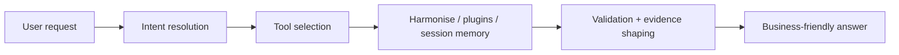

# High-Level Design

## Purpose

HTH Stock Intelligence is a conversational inventory layer over the Harmonise catalogue. It does not replace Harmonise; it makes Harmonise easier to use from natural language while keeping every answer grounded in backend data.

The main business problem is translation:

- Users ask broad questions like “show me white gloss floors in stock.”
- Backend systems require identifiers, supported filters, and exact product or variant boundaries.
- The orchestrator bridges that gap by resolving intent, fetching evidence, and returning safe answers.

## Why the architecture is modular

Each part has a distinct job:

- MCP server: exposes the tool contract.
- Orchestrator: manages session flow and the answer lifecycle.
- Agent engine: drives planning and validation.
- Tool registry: owns the catalogue.
- Stock service: handles Harmonise inventory logic.
- Resolver: handles ambiguity and ranking.
- Weather, news, and currency: stay isolated as plugins.

This separation ensures the same business rules work whether Claude, a local developer, or a browser-based integration asks the question.

## User journey

1. User asks a question in plain English.
2. System decides whether to surface inventory data, a plugin, or session state.
3. For stock requests, it searches the catalogue, resolves the candidate, and pulls detailed evidence.
4. If the request is ambiguous, it returns a short clarification with ranked options instead of guessing.
5. If the request is clear, it returns the answer with plain-language stock, size, pricing, or provenance details.

The user never needs to know the backend API shape—the design hides complexity while preserving accuracy.

## Plugin model

- `stock`: inventory, product, variant, and snapshot workflows.
- `resolver`: ambiguity handling and candidate ranking.
- `session`: working memory for follow-up questions.
- `news`, `weather`, `currency`: optional external helpers.

The runtime loads only what each request requires, keeping extensions focused instead of monolithic.

## How data moves through the app

1. A request enters via MCP or the REST companion API.
2. The orchestrator loads session state.
3. The agent engine builds a plan and decides which tool(s) to call.
4. The tool registry validates arguments and dispatches to the right service.
5. The service fetches from Harmonise, Redis, or an external API.
6. The result is normalized into business-shaped evidence.
7. The response is validated, memoized, and either returned directly or reformatted into a final answer.

## Why Redis is used

Redis stores working memory:

- `session` state lets repeated interactions reuse evidence and clarifications.
- `tool` cache entries prevent redundant upstream hits to Harmonise or plugins.

This is not the system of record. Prefer Redis in production, falling back to in-memory storage only during development.

## Data source boundaries

`SQL DB → Harmonise → Python Orchestrator → MCP/REST → User`

That keeps the Python runtime from inventing fields Harmonise does not return.

## Why confidence and clarification matter

- If one product clearly matches, the runtime proceeds to detail lookup.
- If several products are plausible, it returns a clarification prompt.
- If a product family is confirmed but the variant is ambiguous, it asks for the missing detail.

This avoids false certainty and stays safe for downstream inventory APIs that expect exact identifiers.

## What “success” looks like

A successful run:

- Delivers an answer a non-technical user understands.
- Supports the answer with retrieved evidence.
- Names the right product or variant.
- Explains limitations instead of hiding them.

That is the business standard the architecture tries to meet.
