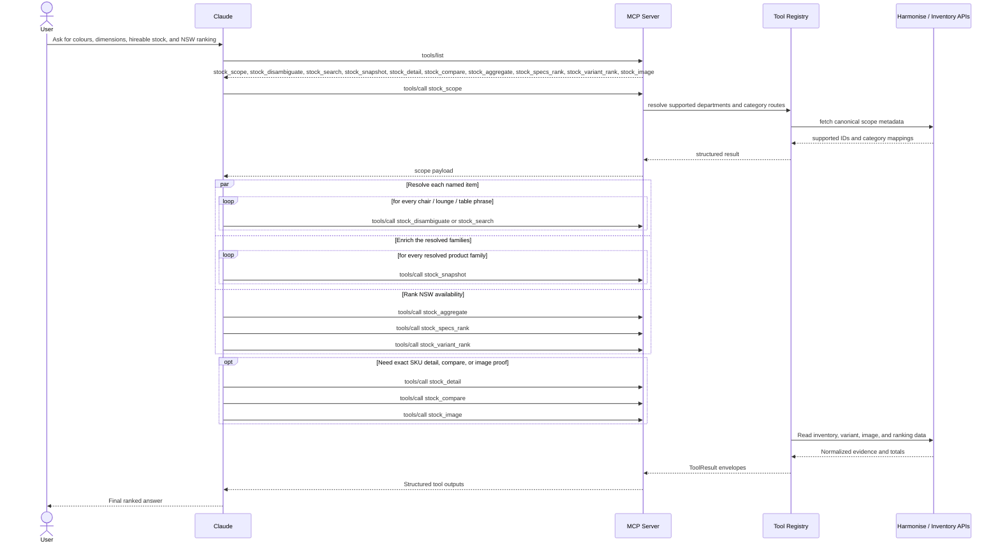

# Claude and MCP multi-tool inventory flow

This document shows how a single user request can fan out across multiple MCP tools before Claude writes the final answer.

## Scenario

User query:

```plaintext
You need to let me know the available colours, dimensions and hireable stock count for each of these items:
* Albert chair
* Alto chair
* Astro chair
* Baxter chair
* Camille chair
* Charlie chair
* Ergo chair
* Padding chair
* Spencer chair
* Sunday chair

A few lounges:
* Erik lounge
* Pacific corner lounge

And the following tables:
* Ava table
* Arc Bar table
* Lava table
* Neptune table
```

The key idea is that Claude should not try to answer this from memory. It should discover the available tools, resolve each product family, collect the full variant data, then rank the NSW results.

## Architecture



## How The Tools Fit Together

- `stock_scope` is the first stop when Claude needs supported departments, category IDs, or canonical scope counts.
- `stock_disambiguate` is used when a phrase could match multiple product families and Claude needs a ranked choice or clarification.
- `stock_search` finds candidate product families and SKUs.
- `stock_snapshot` is the safest default for family-level availability because it returns variant rows with sizes, stock text, and hireable counts.
- `stock_detail` is for exact product or SKU detail once Claude already knows what it is asking for.
- `stock_compare` is for explicit side-by-side comparison of 2 to 20 resolved variants.
- `stock_aggregate` answers grouped stock questions such as "rank these by NSW stock" or "which product family has the most stock".
- `stock_specs_rank` is for ranking that also depends on dimensions, pricing, hierarchy, or filtered attributes.
- `stock_variant_rank` is for ranking variants inside one family.
- `stock_image` is optional when visual confirmation is useful.

For the sample query, Claude would usually:

1. Call `stock_scope` to confirm the supported furniture routes.
2. Call `stock_disambiguate` or `stock_search` for each named product phrase.
3. Call `stock_snapshot` for each resolved family so every variant is covered.
4. Call `stock_detail` if a SKU or exact product needs deeper metadata.
5. Call `stock_compare` if two variants need an explicit comparison.
6. Call `stock_aggregate` to rank NSW stock by product or family.
7. Call `stock_specs_rank` if the user also cares about dimensions or other specs in the ranking.
8. Call `stock_variant_rank` when the ranking should happen inside one family.
9. Call `stock_image` if Claude should surface an image alongside the stock answer.

## MCP Tool Discovery

This is a representative `tools/list` request and response. The exact tool order may vary, but the response shows that Claude can discover multiple tools from one MCP connection.

```json
{
  "jsonrpc": "2.0",
  "id": 1,
  "method": "tools/list",
  "params": {}
}
```

```json
{
  "jsonrpc": "2.0",
  "id": 1,
  "result": {
    "tools": [
      {
        "name": "stock_scope",
        "description": "Supported stock scope and filter IDs."
      },
      {
        "name": "stock_disambiguate",
        "description": "Rank ambiguous catalogue candidates for a user phrase and return either a resolved product family or clarification options."
      },
      {
        "name": "stock_search",
        "description": "Harmonise catalogue discovery by product/family text plus supported filters."
      },
      {
        "name": "stock_snapshot",
        "description": "Answer-ready inventory snapshot for broad or multi-variant stock questions."
      },
      {
        "name": "stock_detail",
        "description": "Exact product-family or SKU detail."
      },
      {
        "name": "stock_compare",
        "description": "Side-by-side comparison of already-resolved variant SKUs/identifiers."
      },
      {
        "name": "stock_aggregate",
        "description": "Grouped stock and hirable totals from a full inventory snapshot."
      },
      {
        "name": "stock_specs_rank",
        "description": "Rank and filter products or variants by stock, dimensions, pricing, hierarchy, state, and attributes."
      },
      {
        "name": "stock_variant_rank",
        "description": "Rank variants within a named product or family."
      },
      {
        "name": "stock_image",
        "description": "Resolve a Harmonise product image from an exact image path, SKU, or family search."
      }
    ]
  }
}
```

## Tool Call And Response

This is one representative `tools/call` example. In the real conversation, Claude would repeat this pattern for each product family and then finish with a ranking call for NSW.

Request:

```json
{
  "jsonrpc": "2.0",
  "id": 7,
  "method": "tools/call",
  "params": {
    "name": "stock_snapshot",
    "arguments": {
      "search": "Alto chair",
      "page": 1,
      "pageSize": 20
    }
  }
}
```

Response:

```json
{
  "jsonrpc": "2.0",
  "id": 7,
  "result": {
    "content": [
      {
        "type": "text",
        "text": "{\"answer_ready\":{\"coverage\":{\"isPartial\":false},\"rows\":[{\"product\":\"Alto chair\",\"variant\":\"Alto chair - Grey Mesh\",\"sku\":\"ALT-001\",\"size\":\"W 510 x D 560 x H 820\",\"stock\":\"Overall stock: 12. NSW hirable: 8.\"}]},\"data\":{\"rows\":[{\"product\":\"Alto chair\",\"variant\":\"Alto chair - Grey Mesh\",\"sku\":\"ALT-001\",\"attributeEvidence\":[\"grey mesh\",\"seat height\"],\"size\":\"W 510 x D 560 x H 820\",\"stock\":\"Overall stock: 12. NSW hirable: 8.\",\"knownSpecs\":[\"colour: grey\",\"material: mesh\"]}],\"coverage\":{\"requestedPage\":1,\"requestedPageSize\":20,\"matchedProducts\":1,\"matchedPages\":1,\"enrichedProducts\":1,\"enrichedVariants\":1,\"isPartial\":false,\"limitations\":[],\"variantCaps\":[]},\"evidence\":[{\"product\":\"Alto chair\",\"variant\":\"Alto chair - Grey Mesh\",\"sku\":\"ALT-001\",\"variationOptions\":[\"Grey\"],\"salesNote\":null,\"dimensions\":{\"dimensional\":true,\"canBeSoldInPortions\":false,\"length\":510.0,\"width\":560.0,\"height\":820.0},\"stock\":{\"totalHirable\":8,\"vicStock\":0,\"vicHirable\":0,\"nswStock\":12,\"nswHirable\":8,\"qldStock\":0,\"qldHirable\":0,\"totalStock\":12},\"pricing\":{\"generalRate\":null,\"expoRate\":null,\"cost\":null},\"media\":{\"imageFileName\":null,\"imageUrl\":null},\"isActive\":true,\"provenance\":{\"tool\":\"stock_snapshot\",\"matched_on\":[\"product\"],\"confidence\":0.94,\"source_path\":\"products.items[0].variants[0]\"}}],\"guidance\":\"Answer-ready inventory snapshot for a named product family.\"},\"normalization_notes\":[]}"
      }
    ],
    "structuredContent": {
      "answer_ready": {
        "coverage": {
          "isPartial": false
        },
        "rows": [
          {
            "product": "Alto chair",
            "variant": "Alto chair - Grey Mesh",
            "sku": "ALT-001",
            "size": "W 510 x D 560 x H 820",
            "stock": "Overall stock: 12. NSW hirable: 8."
          }
        ]
      },
      "data": {
        "rows": [
          {
            "product": "Alto chair",
            "variant": "Alto chair - Grey Mesh",
            "sku": "ALT-001",
            "attributeEvidence": [
              "grey mesh",
              "seat height"
            ],
            "size": "W 510 x D 560 x H 820",
            "stock": "Overall stock: 12. NSW hirable: 8.",
            "knownSpecs": [
              "colour: grey",
              "material: mesh"
            ]
          }
        ],
        "coverage": {
          "requestedPage": 1,
          "requestedPageSize": 20,
          "matchedProducts": 1,
          "matchedPages": 1,
          "enrichedProducts": 1,
          "enrichedVariants": 1,
          "isPartial": false,
          "limitations": [],
          "variantCaps": []
        },
        "evidence": [
          {
            "product": "Alto chair",
            "variant": "Alto chair - Grey Mesh",
            "sku": "ALT-001",
            "variationOptions": [
              "Grey"
            ],
            "salesNote": null,
            "dimensions": {
              "dimensional": true,
              "canBeSoldInPortions": false,
              "length": 510.0,
              "width": 560.0,
              "height": 820.0
            },
            "stock": {
              "totalHirable": 8,
              "vicStock": 0,
              "vicHirable": 0,
              "nswStock": 12,
              "nswHirable": 8,
              "qldStock": 0,
              "qldHirable": 0,
              "totalStock": 12
            },
            "pricing": {
              "generalRate": null,
              "expoRate": null,
              "cost": null
            },
            "media": {
              "imageFileName": null,
              "imageUrl": null
            },
            "isActive": true,
            "provenance": {
              "tool": "stock_snapshot",
              "matched_on": [
                "product"
              ],
              "confidence": 0.94,
              "source_path": "products.items[0].variants[0]"
            }
          }
        ],
        "guidance": "Answer-ready inventory snapshot for a named product family."
      },
      "normalization_notes": []
    }
  }
}
```

## Claude Response

After the tool calls above, Claude would turn the structured results into a single answer that:

- Lists each requested chair, lounge, and table.
- Shows the available colours and dimensions per family or variant.
- Summarizes hireable stock for each item.
- Ranks the families by NSW stock availability.
- Calls out any partial coverage, ambiguity, or missing data instead of guessing.

In other words, the MCP layer does the retrieval and ranking work, while Claude does the orchestration and final explanation.
