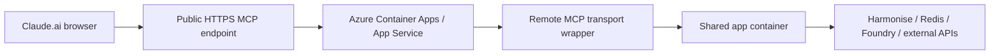

# Phase 2: Azure Deployment for Claude.ai Browser Access

Deploy the MCP service to Azure so Claude.ai can connect through a browser-based MCP workflow. Since the built-in server is stdio-based (`python3 -m app.mcp.server`), Claude.ai and the Anthropic connector require a public HTTP or SSE MCP endpoint that reuses the same tool registry and services.

Official references:

- [Anthropic MCP overview](https://docs.anthropic.com/en/docs/mcp)
- [Anthropic MCP connector](https://docs.anthropic.com/en/docs/agents-and-tools/mcp-connector)
- [Anthropic Claude Code MCP docs](https://docs.anthropic.com/en/docs/claude-code/mcp)
- [Azure Container Apps ingress](https://learn.microsoft.com/en-us/azure/container-apps/ingress-overview)
- [Azure Container Apps environment variables](https://learn.microsoft.com/en-us/azure/container-apps/environment-variables)

## 1. Target architecture



Recommended Azure components:

- Azure Container Apps for the public HTTP MCP endpoint
- Azure Container Registry for the image
- Azure Key Vault for secrets
- Azure Cache for Redis (or Managed Redis) for session and tool cache state
- Azure Monitor / Application Insights for logs and traces

Container Apps is preferred because it supports external ingress with TLS, custom domains, environment variables/secrets, and revision-based rollouts. App Service is an acceptable alternative when your team prefers a traditional web app model.

## 2. What must be deployed

The repo exposes:

- `python3 -m app.mcp.server` (stdio MCP)
- `uvicorn app.main:app` (REST companion)

Claude.ai cannot consume the stdio surface directly. Deploy one of these patterns:

### Option A (recommended)

Build a small HTTP MCP wrapper that imports the shared container and exposes HTTP or SSE MCP transport.

### Option B (alternative)

Deploy a companion service that already speaks the remote MCP transport and forwards calls into the shared registry and orchestrator.

Do not treat the REST endpoints as MCP; they are only for diagnostics.

## 3. Prerequisites

- Azure subscription with permissions for resource groups, container registries, container apps, Key Vault, and Redis
- Public DNS name for the MCP endpoint
- The repository’s runtime environment variables
- Claude.ai workspace or team that supports MCP connectors

## 4. Build strategy

Use Docker for the Azure image. The existing `Dockerfile` targets the REST app; browser-facing deployments need a wrapper that starts your HTTP MCP transport.

Workflow:

1. Build locally
2. Tag for Azure Container Registry (ACR)
3. Push to ACR
4. Deploy a Container App from the image

Example:

```bash
az group create -n hth-mcp-rg -l australiaeast
az acr create -g hth-mcp-rg -n hthmcpacr123 -sku Basic
az acr login -n hthmcpacr123
docker build -f Dockerfile.mcp -t hth-mcp-mcp:latest .
docker tag hth-mcp-mcp:latest hthmcpacr123.azurecr.io/hth-mcp-mcp:latest
docker push hthmcpacr123.azurecr.io/hth-mcp-mcp:latest
```

## 5. Azure resource checklist

1. Resource group
2. Container Registry
3. Redis
4. Key Vault
5. Container Apps environment
6. Container App with external ingress
7. Custom domain and TLS certificate
8. Application Insights or Log Analytics

Reuse existing Redis or Key Vault resources when possible.

## 6. Required environment variables

### Core runtime

- `AZURE_AI_FOUNDRY_ENDPOINT`
- `AZURE_AI_FOUNDRY_API_KEY`
- `AZURE_AI_FOUNDRY_MODEL`
- `AZURE_AI_FOUNDRY_SLM`
- `HTH_REDIS_URL`
- `HTH_LOG_LEVEL`

### Harmonise

- `LOCAL_HARMONISE=false`
- `CLOUD_HARMONISE_ENDPOINT`
- `CLOUD_HARMONISE_API`
- `CLOUD_HARMONISE_IMAGE`

### External plugins

- `EXCHANGE_RATE_API`
- `OPEN_WEATHER_API`
- `NEWS_API`

### Operational toggles

- `HTH_REDIS_FALLBACK_ENABLED=false` (unless you intentionally want fallback)
- `HTH_LOCAL_CHAT_MEMORY_ENABLED=false` (unless you want follow-up memory)
- `HTH_ENABLE_MOCK_UI_SIMULATION=false`

Store secrets in Key Vault when possible.

## 7. Container Apps deployment

Create a Container App with external ingress so Claude.ai can reach it over HTTPS.

Key settings:

- Ingress: external
- Target port: the port used by your HTTP MCP wrapper
- Transport: HTTP or SSE
- TLS: enabled
- Auth: bearer token or OAuth, depending on your connector strategy

Container Apps supports TLS termination, custom domains, and IP restrictions for controlled, public access.

Example deployment sketch:

```bash
az containerapp env create   --name hth-mcp-env   --resource-group hth-mcp-rg   --location australiaeast

az containerapp create   --name hth-mcp   --resource-group hth-mcp-rg   --environment hth-mcp-env   --image hthmcpacr123.azurecr.io/hth-mcp:latest   --ingress external   --target-port 3000   --registry-server hthmcpacr123.azurecr.io   --env-vars     LOCAL_HARMONISE=false     CLOUD_HARMONISE_ENDPOINT=https://your-harmonise.example.com     HTH_REDIS_URL=redis://your-redis-host:6379     HTH_LOG_LEVEL=INFO
```

Use Key Vault references for sensitive values if you store them there. If you have separate deployments for the REST app and the browser-facing MCP wrapper, give each its own app settings and secrets.

## 8. App Service deployment alternative

If your team prefers App Service:

- Use a custom Linux container.
- Enable HTTPS-only.
- Configure app settings via portal or CLI.
- Ensure the container listens on the expected port.
- Use deployment slots for safer rollouts.

App Service works for a simple public container, but Container Apps offers better revision control.

## 9. Remote MCP transport requirements

Browser connectors expect:

- Public HTTPS endpoint
- MCP transport over HTTP or SSE (not stdio)
- An auth scheme configurable in Claude/Anthropic

Ensure your wrapper responds to `tools/list`, accepts `tools/call`, preserves structured `isError` payloads, and retains the shared session or client id if provided.

## 10. Authentication pattern

Choose one pattern:

### Bearer token

Quick for pilots. Store the token in the Claude connector and validate it in the wrapper.

### OAuth

Better for multi-user or production deployments with user-level identity support.

### IP restrictions

Use Container Apps IP restrictions or a front door/WAF layer for tighter exposure control.

Avoid exposing the MCP endpoint without authentication.

## 11. Validation steps

Before connecting Claude.ai, run the checks that mirror your wrapper’s requests:

1. `GET` the health endpoint to confirm the container is ready.
2. `tools/list` and confirm the stock, resolver, session, weather, news, and currency tools appear.
3. Call a stock tool and confirm structured JSON returns.
4. Confirm Redis is reachable and session state persists.
5. Confirm the auth header is enforced.

You can also test the endpoint through the Anthropic Messages API before wiring it into Claude.ai.

## 12. Connecting Claude.ai in the browser

Typical steps:

1. Open the Claude.ai workspace or team settings for MCP connectors.
2. Add a new remote MCP server.
3. Enter the public HTTPS URL for your Azure endpoint.
4. Provide the bearer token or complete OAuth.
5. Save, refresh the tool list, and run a safe stock lookup.

If the UI only allows team-managed connectors, coordinate with the workspace admin.

## 13. Production hardening

Recommended settings:

- `HTH_REDIS_FALLBACK_ENABLED=false`
- `HTH_LOCAL_CHAT_MEMORY_ENABLED=false`
- `HTH_ENABLE_MOCK_UI_SIMULATION=false`
- Dedicated Key Vault secrets for all credentials
- Custom domain with managed TLS
- Logging and traces shipped to Azure Monitor
- IP restrictions or WAF if you need tighter control

Ensure the remote wrapper sanitizes tool errors—return structured errors, not raw stack traces.

## 14. Troubleshooting

### Claude.ai cannot see the tools

- Verify the endpoint is public HTTPS.
- Confirm the transport is HTTP or SSE, not stdio.
- Check the auth token.
- Ensure the wrapper exposes `tools/list`.

### Tools appear but calls fail

- Inspect Azure logs.
- Check Redis connectivity.
- Verify the Harmonise endpoint and API key.
- Verify Foundry credentials.

### The app starts but returns empty or partial answers

- Confirm `AZURE_AI_FOUNDRY_ENDPOINT` and `AZURE_AI_FOUNDRY_API_KEY`.
- Confirm plugin API keys are present.
- Confirm Harmonise returns the expected fields.

## 15. Deployment summary

The shortest safe path is:

1. Containerize the Python app.
2. Add or deploy a public HTTP MCP wrapper.
3. Push the image to Azure Container Registry.
4. Deploy to Azure Container Apps with external ingress and TLS.
5. Store secrets in Key Vault.
6. Connect Claude.ai to the public MCP URL.
7. Verify tool calls and session persistence.

The stdio MCP server remains ideal for local desktop clients but still needs a remote HTTP transport before Claude.ai can consume it.
