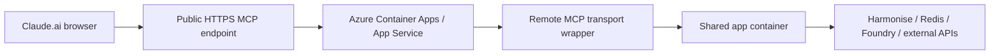

# Phase 2: Azure Deployment for Claude.ai Browser Access

Deploy the MCP service to Azure so Claude.ai can connect through a browser-based MCP workflow. Since the built-in server is stdio-based (`python3 -m app.mcp.server`), Claude.ai and the Anthropic connector require a public HTTP or SSE MCP endpoint that reuses the same tool registry and services.

Official references:

- [Anthropic MCP overview](https://docs.anthropic.com/en/docs/mcp)
- [Anthropic MCP connector](https://docs.anthropic.com/en/docs/agents-and-tools/mcp-connector)
- [Anthropic Claude Code MCP docs](https://docs.anthropic.com/en/docs/claude-code/mcp)
- [Azure Container Apps ingress](https://learn.microsoft.com/en-us/azure/container-apps/ingress-overview)
- [Azure Container Apps environment variables](https://learn.microsoft.com/en-us/azure/container-apps/environment-variables)

This guide focuses on exposing the repo’s tool registry to Claude.ai via the Model Context
Protocol transport, not Azure AI Foundry. The container now hosts a `StreamableHTTPSessionManager`
from `mcp.server.streamable_http_manager`, so a single `uvicorn app.main:app` command
publishes both the REST diagnostics routes and a `/mcp` HTTP/SSE gateway that serves the
standard MCP `tools/list` and `tools/call` RPCs.

## 1. Target architecture



Azure Container Apps or App Service now runs `uvicorn app.main:app`, which mounts
`StreamableHTTPSessionManager` at `HTH_MCP_PATH` (`/mcp` by default). Claude.ai connects over
HTTP or SSE to that path, and every request is handled by the same orchestrator stack that
powers the internal REST diagnostics API on `HTH_API_PREFIX`. This keeps the MCP channel
protocol-compliant without duplicating any tool logic or relying on Azure Foundry’s chat
facilities.

Recommended Azure components:

- Azure Container Apps for the public HTTP MCP endpoint
- Azure Container Registry for the image
- Azure Key Vault for secrets
- Azure Cache for Redis (or Managed Redis) for session and tool cache state
- Azure Monitor / Application Insights for logs and traces

Container Apps is preferred because it supports external ingress with TLS, custom domains, environment variables/secrets, and revision-based rollouts. App Service is an acceptable alternative when your team prefers a traditional web app model.

## 2. What must be deployed

The repo exposes:

- `uvicorn app.main:app` (REST diagnostics plus the built-in `/mcp` HTTP/SSE transport)
- `python3 -m app.mcp.server` (stdio MCP for local desktop or CLI tooling)

Use the `/mcp` transport for Claude.ai—`StreamableHTTPSessionManager` routes every HTTP or SSE request
into the shared orchestrator via `app.mcp.server`, so you do not need a separate wrapper service.
The REST surface remains for diagnostics only and must not be masqueraded as the MCP transport.

## 3. Prerequisites

- Azure subscription with permissions for resource groups, container registries, container apps, Key Vault, and Redis
- Public DNS name for the MCP endpoint
- The repository’s runtime environment variables
- A Key Vault secret (or app setting) for `HTH_MCP_BEARER_TOKEN` so Claude.ai can authenticate
- TLS for the public `/mcp` path so the remote MCP connector sees a secure HTTPS transport
- Claude.ai workspace or team that supports MCP connectors

## 4. Build strategy

`script/push.sh` automates the Docker build/push workflow so the same single image contains both the REST surface and the `/mcp` transport.

1. Run `REGISTRY=youracr.azurecr.io ./script/push.sh`.
2. When prompted, enter a semantic `x.x.x` version (the script still accepts non-standard versions but warns).
3. The script adds the current date to the tag, builds from `Dockerfile`, tags it as `<registry>/hth-mcp/hth-harmonise-mcp:<date>-<version>`, and pushes to ACR.
4. Capture the final `registry_image` value and point your Container App deployment at it.

The script already checks for Docker, logs into ACR when the registry ends with `.azurecr.io`, and runs `docker buildx build --platform linux/amd64`, so you can reuse it for fast CI releases.

Example Azure CLI sequence (adjust version/tag to match the script output):

```bash
az group create -n hth-mcp-rg -l australiaeast
az acr create -g hth-mcp-rg -n hthmcpacr123 -sku Basic
az acr login -n hthmcpacr123
REGISTRY=hthmcpacr123.azurecr.io ./script/push.sh
```

## 5. Azure resource checklist

1. Resource group
2. Container Registry
3. Redis
4. Key Vault (store the `HTH_MCP_BEARER_TOKEN`, any Redis/Foundry keys, and the certifications used in container settings)
5. Container Apps environment
6. Container App with external ingress pointing to port 3000 and the `/mcp` path
7. Custom domain and TLS certificate
8. Application Insights or Log Analytics

Reuse existing Redis or Key Vault resources when possible.

## 6. Required environment variables

### Core runtime

- `AZURE_AI_FOUNDRY_ENDPOINT`
- `AZURE_AI_FOUNDRY_API_KEY`
- `AZURE_AI_FOUNDRY_MODEL`
- `AZURE_AI_FOUNDRY_SLM`
- `HTH_REDIS_URL`
- `HTH_LOG_LEVEL`

### Harmonise

- `LOCAL_HARMONISE=false`
- `CLOUD_HARMONISE_ENDPOINT`
- `CLOUD_HARMONISE_API`
- `CLOUD_HARMONISE_IMAGE`

### Remote MCP transport

- `HTH_MCP_PATH` (`/mcp` by default; matches the Azure ingress path you expose)
- `HTH_MCP_BEARER_TOKEN` (store this secret in Key Vault and pass it into Claude’s connector)
- `HTH_MCP_STATELESS=false` (set to `true` for simple regressions when you want each request to start a fresh session)
- `HTH_MCP_JSON_RESPONSE=false` (enable only if Claude requires the HTTP transport to always respond with JSON instead of SSE)
- `HTH_MCP_SESSION_IDLE_TIMEOUT_SECONDS=1800` (session inactivity TTL before the StreamableHTTP session closes)
- `HTH_MCP_RETRY_INTERVAL_MS=2500` (SSE retry hint so Claude knows how often to poll the stream)

### Security controls

- `HTH_MCP_ALLOWED_HOSTS` (comma-separated hostnames for Azure’s DNS rebinding protection)
- `HTH_MCP_ALLOWED_ORIGINS` (comma-separated origins if you serve the wrapper behind multiple domains)

### Operational toggles

- `HTH_REDIS_FALLBACK_ENABLED=false` (unless you intentionally want fallback)
- `HTH_LOCAL_CHAT_MEMORY_ENABLED=false` (unless you want follow-up memory)
- `HTH_ENABLE_MOCK_UI_SIMULATION=false`

Defaults for many MCP settings are baked into `Dockerfile`, so you can rely on the `/mcp`
path, session timeout, and retry interval unless you explicitly override them at deployment time.
Store secrets in Key Vault whenever possible so Container Apps can reference `@Microsoft.KeyVault(...)`
values in their app settings.

## 7. Container Apps deployment

Create a Container App with external ingress so Claude.ai can reach it over HTTPS.

Key settings:

-- Ingress: external (HTTPS)
-- Target port: 3000 (the single `uvicorn` process handles both REST and `/mcp`)
-- Path: match `HTH_MCP_PATH` (default `/mcp`)
-- Transport: HTTP or SSE
-- TLS: enabled
-- Auth: bearer token or OAuth, depending on your connector strategy

Container Apps supports TLS termination, custom domains, and IP restrictions for controlled, public access.

Ensure any Key Vault references (for example, `HTH_MCP_BEARER_TOKEN` or `HTH_REDIS_URL`) are injected as app settings so the streaming transport can load its secrets at runtime. The `/mcp` endpoint must line up with the ingress path so Claude.ai’s connector hits `https://<host>/mcp`. You can also add an IP restriction rule to the Container App if you know the Claude workspace ranges you expect.

Example deployment sketch:

```bash
az containerapp env create   --name hth-mcp-env   --resource-group hth-mcp-rg   --location australiaeast

az containerapp create   --name hth-mcp   --resource-group hth-mcp-rg   --environment hth-mcp-env   --image hthmcpacr123.azurecr.io/hth-mcp:latest   --ingress external   --target-port 3000   --registry-server hthmcpacr123.azurecr.io   --env-vars     LOCAL_HARMONISE=false     CLOUD_HARMONISE_ENDPOINT=https://your-harmonise.example.com     HTH_REDIS_URL=redis://your-redis-host:6379     HTH_LOG_LEVEL=INFO
```

For a fully populated example with Token/timeout overrides:

```bash
az containerapp create \
  --name hth-mcp \
  --resource-group hth-mcp-rg \
  --environment hth-mcp-env \
  --image hthmcpacr123.azurecr.io/hth-mcp:latest \
  --ingress external \
  --target-port 3000 \
  --registry-server hthmcpacr123.azurecr.io \
  --env-vars \
      LOCAL_HARMONISE=false \
      CLOUD_HARMONISE_ENDPOINT=https://your-harmonise.example.com \
      HTH_REDIS_URL=redis://your-redis-host:6379 \
      HTH_LOG_LEVEL=INFO \
      HTH_MCP_PATH=/mcp \
      HTH_MCP_BEARER_TOKEN=@Microsoft.KeyVault(SecretUri=https://<vault>.vault.azure.net/secrets/claude-token) \
      HTH_MCP_SESSION_IDLE_TIMEOUT_SECONDS=1800 \
      HTH_MCP_RETRY_INTERVAL_MS=2500
```

Use Key Vault references for sensitive values if you store them there. If you have separate deployments for the REST app and the browser-facing MCP wrapper, give each its own app settings and secrets.

## 8. App Service deployment alternative

If your team prefers App Service:

- Use a custom Linux container.
- Enable HTTPS-only.
- Configure app settings via portal or CLI.
- Ensure the container listens on the expected port.
- Use deployment slots for safer rollouts.

App Service works for a simple public container, but Container Apps offers better revision control.

## 9. Remote MCP transport requirements

Claude/Anthropic’s browser connector hits the `/mcp` path exposed by `StreamableHTTPSessionManager`, so you only need to ensure:

- Public HTTPS endpoint with external ingress (Container Apps handles TLS termination).
- The ingress path matches `HTH_MCP_PATH` (default `/mcp`), and the target port is 3000.
- MCP transport over HTTP or SSE (never stdio); our manager negotiates the right framing automatically.
- An auth scheme that aligns with Claude’s connector. When using a bearer token, store it in Key Vault and surface it as `HTH_MCP_BEARER_TOKEN`, and verify the connector’s `Authorization: Bearer ...` header.
- Optional session tuning:
  - `HTH_MCP_STATELESS=true` for stateless testing between requests.
  - `HTH_MCP_SESSION_IDLE_TIMEOUT_SECONDS` to tear down idle sessions (default 1800 seconds).
  - `HTH_MCP_RETRY_INTERVAL_MS` to give Claude a reliable SSE reconnect window (default 2500 ms).
- Host/origin validation via `HTH_MCP_ALLOWED_HOSTS`/`HTH_MCP_ALLOWED_ORIGINS` if you need DNS-rebinding protection.

The built-in transport already responds to `tools/list`, handles `tools/call`, formats `isError` payloads, and keeps tool/session IDs in sync with the orchestrator so Claude sees the same capabilities as backend diagnostics.

## 10. Authentication pattern

Choose one pattern:

### Bearer token

Quick for pilots. Store the token in the Claude connector and validate it in the wrapper.

### OAuth

Better for multi-user or production deployments with user-level identity support.

### IP restrictions

Use Container Apps IP restrictions or a front door/WAF layer for tighter exposure control.

Avoid exposing the MCP endpoint without authentication.

For the bearer token path, keep the secret in Key Vault and reference it from the Container App via
`@Microsoft.KeyVault(SecretUri=...)`. Claude.ai’s remote MCP connector should send that token as
`Authorization: Bearer <token>` whenever it hits `HTH_MCP_PATH`. You can also layer on `HTH_MCP_ALLOWED_HOSTS`
and `HTH_MCP_ALLOWED_ORIGINS` to limit DNS rebinding.

## 11. Validation steps

Before connecting Claude.ai, run the checks that mirror your wrapper’s requests:

1. `GET` the health endpoint to confirm the container is ready.
2. `tools/list` and confirm the stock, resolver, session, weather, news, and currency tools appear.
3. Call a stock tool and confirm structured JSON returns.
4. Confirm Redis is reachable and session state persists.
5. Confirm the auth header is enforced.

You can also test the endpoint through the Anthropic Messages API before wiring it into Claude.ai.

Additional checks:

- `curl -H "Authorization: Bearer <token>" https://<mcp-host>/mcp` should open the stream and emit an SSE `retry` hint consistent with `HTH_MCP_RETRY_INTERVAL_MS`.
- POST a JSON-RPC `tools/call` payload to `/mcp` with `Content-Type: application/json` and ensure the response includes structured `data` or `isError` metadata instead of raw stack traces.

## 12. Connecting Claude.ai in the browser

Typical steps:

1. Open the Claude.ai workspace or team settings for MCP connectors.
2. Add a new remote MCP server.
3. Enter the public HTTPS URL for your Azure endpoint, including the `HTH_MCP_PATH` (`https://<domain>/mcp` by default).
4. Provide the bearer token or complete OAuth.
  - If you are using bearer token auth, copy the secret referenced by `HTH_MCP_BEARER_TOKEN`.
  - Claude will send `Authorization: Bearer <token>` with each `tools/*` request.
5. Save, refresh the tool list, and run a safe stock lookup.

If the UI only allows team-managed connectors, coordinate with the workspace admin.

## 13. Production hardening

Recommended settings:

- `HTH_REDIS_FALLBACK_ENABLED=false`
- `HTH_LOCAL_CHAT_MEMORY_ENABLED=false`
- `HTH_ENABLE_MOCK_UI_SIMULATION=false`
- Dedicated Key Vault secrets for all credentials
- Custom domain with managed TLS
- Logging and traces shipped to Azure Monitor
- IP restrictions or WAF if you need tighter control

Additional production guardrails:

- Configure `HTH_MCP_BEARER_TOKEN` via Key Vault and keep it out of version control.
- Set `HTH_MCP_ALLOWED_HOSTS`/`HTH_MCP_ALLOWED_ORIGINS` to match your DNS and origin values.
- Tune `HTH_MCP_SESSION_IDLE_TIMEOUT_SECONDS` and `HTH_MCP_RETRY_INTERVAL_MS` so Claude doesn’t reopen sessions too quickly.

Ensure the remote wrapper sanitizes tool errors—return structured errors, not raw stack traces.

## 14. Troubleshooting

### Claude.ai cannot see the tools

- Verify the endpoint is public HTTPS.
- Confirm the transport is HTTP or SSE, not stdio.
- Check the auth token.
- Ensure the wrapper exposes `tools/list`.
- Confirm the ingress path matches `HTH_MCP_PATH` and Claude’s connector is requesting `/mcp`.

### Tools appear but calls fail

- Inspect Azure logs.
- Check Redis connectivity.
- Verify the Harmonise endpoint and API key.
- Verify Foundry credentials.
- Check that `HTH_MCP_BEARER_TOKEN` matches the token Claude is sending and that any host/origin filters allow the request.

### The app starts but returns empty or partial answers

- Confirm `AZURE_AI_FOUNDRY_ENDPOINT` and `AZURE_AI_FOUNDRY_API_KEY`.
- Confirm plugin API keys are present.
- Confirm Harmonise returns the expected fields.

## 15. Deployment summary

The shortest safe path is:

1. Containerize the Python app and push it via `script/push.sh` so Azure Container Registry hosts `hth-mcp/hth-harmonise-mcp:<date>-<version>`.
2. Configure `HTH_MCP_PATH`, `HTH_MCP_BEARER_TOKEN`, session tuning, and host/origin filters in Key Vault/app settings.
3. Deploy a Container App with external HTTPS ingress on port 3000 and map the `/mcp` path to the `StreamableHTTPSessionManager`.
4. Store `HTH_REDIS_URL`, `HTH_MCP_BEARER_TOKEN`, and other secrets in Key Vault so the Container App can pull them.
5. Connect Claude.ai to `https://<your-domain>/mcp` using the bearer token/OAuth you configured.
6. Verify `tools/list`, `tools/call`, and session persistence via Redis/health checks.

The stdio MCP server still exists for local desktop or CLI clients, but remote browsers must use the `/mcp` HTTP transport we ship in the container.
