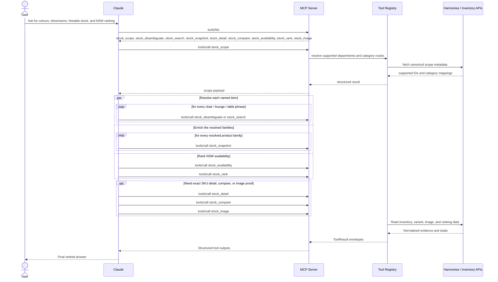

# Executive Summary: MCP Stress Traffic Impact

The Harmonise backend demonstrates **major instability** under MCP-driven traffic patterns. The primary risk is not the average response time, but **unpredictable tail-latency** and **error bursts** that can stall downstream workflows for minutes.

### High-Level Performance Metrics
Across **17,868 requests**, the system recorded the following:

| Metric | Result | Executive Meaning |
| :--- | :--- | :--- |
| **Overall Error Rate** | **4.10%** | Unacceptably high; triggers retry loops and further load. |
| **Overall p95 Latency** | **34.3s** | Slowest 5% are far beyond acceptable UX levels. |
| **Overall p99 Latency** | **84.1s** | Worst 1% indicates severe queuing or timeout risks. |
| **Max Observed Latency** | **133.8s** | Some requests took over 2 minutes to complete. |
| **Max Request Rate** | **4.4 RPS** | Backend shows sensitivity even at low traffic volumes. |
| **Max In-flight Requests** | **38** | Concurrency amplifies latency, but isn't the sole driver. |

---

## 1. Key Insight: Duration over Volume
A critical finding is that **peak traffic volume (RPS) is not the only cause of slowdowns.** Instead, the backend suffers significantly when **heavy traffic is sustained over a long duration.** 

Even if the traffic intensity decreases slightly, the lack of a "cooldown" period prevents the system from recovering. This leads to a compounding degradation where the backend remains slow long after the initial spike, likely due to exhausted connection pools, database contention, or backend queuing that never clears.

---

## 2. Endpoint Performance Breakdown
The backend's instability is split between two distinct issues: SKU lookups are **slow**, while product lists are **error-prone**.

| Endpoint | Error Rate | p95 Latency | p99 Latency | Max Latency |
| :--- | :--- | :--- | :--- | :--- |
| `GET .../products/{skuCode}` | 1.82% | **40.0s** | **90.9s** | **133.8s** |
| `GET .../products` | **12.45%** | 30.2s | 30.3s | 30.8s |

*   **SKU Lookup:** The main driver of extreme tail-latency. MCP workflows often call this repeatedly to enrich data, turning one user query into a barrage of slow backend calls.
*   **Product List:** Shows a high failure rate, which breaks initial discovery and triggers immediate retries, further stressing the system.

---

## 3. Business Risk Assessment

| Risk | Severity | Impact |
| :--- | :--- | :--- |
| **Slow SKU Lookup** | **High** | One user action triggers many calls; high "fan-out" risk. |
| **Product-List Errors** | **High** | Failed searches break the core discovery UX. |
| **"Zombie" Requests** | **High** | Requests taking 100s+ may still return 200 (OK) but are operationally useless. |
| **Retry Amplification** | **High** | Errors/timeouts cause agents to retry, creating a "death spiral" of load. |
| **Lack of Cooldown** | **High** | Sustained moderate load can be more damaging than short high-bursts. |

---

## 4. The MCP "Fan-Out" Effect
The following diagram illustrates how a single user request can explode into a high volume of backend calls, explaining why the backend reaches saturation so quickly.

---

## 5. Recommended Actions

*   **Implement Rate Limiting:** Specifically for SKU-level calls to prevent backend saturation.
*   **Aggressive Caching:** Cache product and SKU details to reduce the need for repeat backend hits.
*   **Request Coalescing:** Group identical SKU requests into a single backend call.
*   **Circuit Breakers:** Automatically stop traffic to Harmonise when error rates or latencies cross a safety threshold.
*   **Enforce Timeouts:** Do not allow requests to hang for 100+ seconds; fail fast to allow the system to "cooldown."
