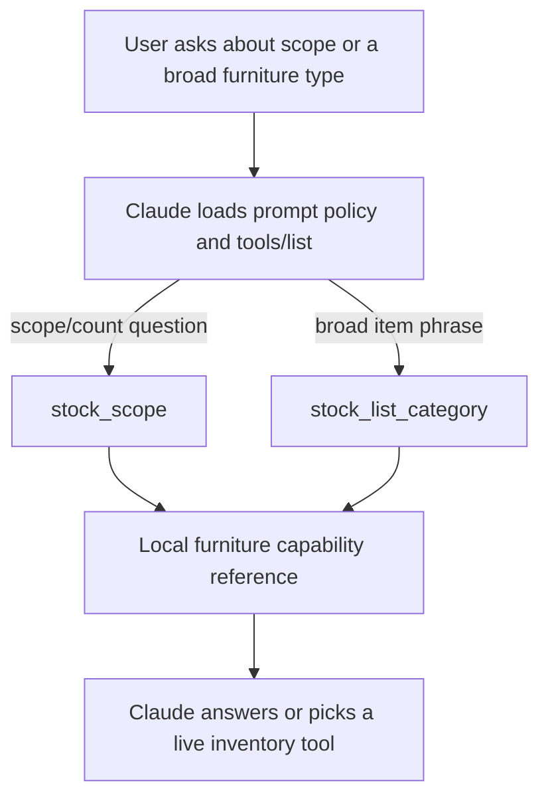
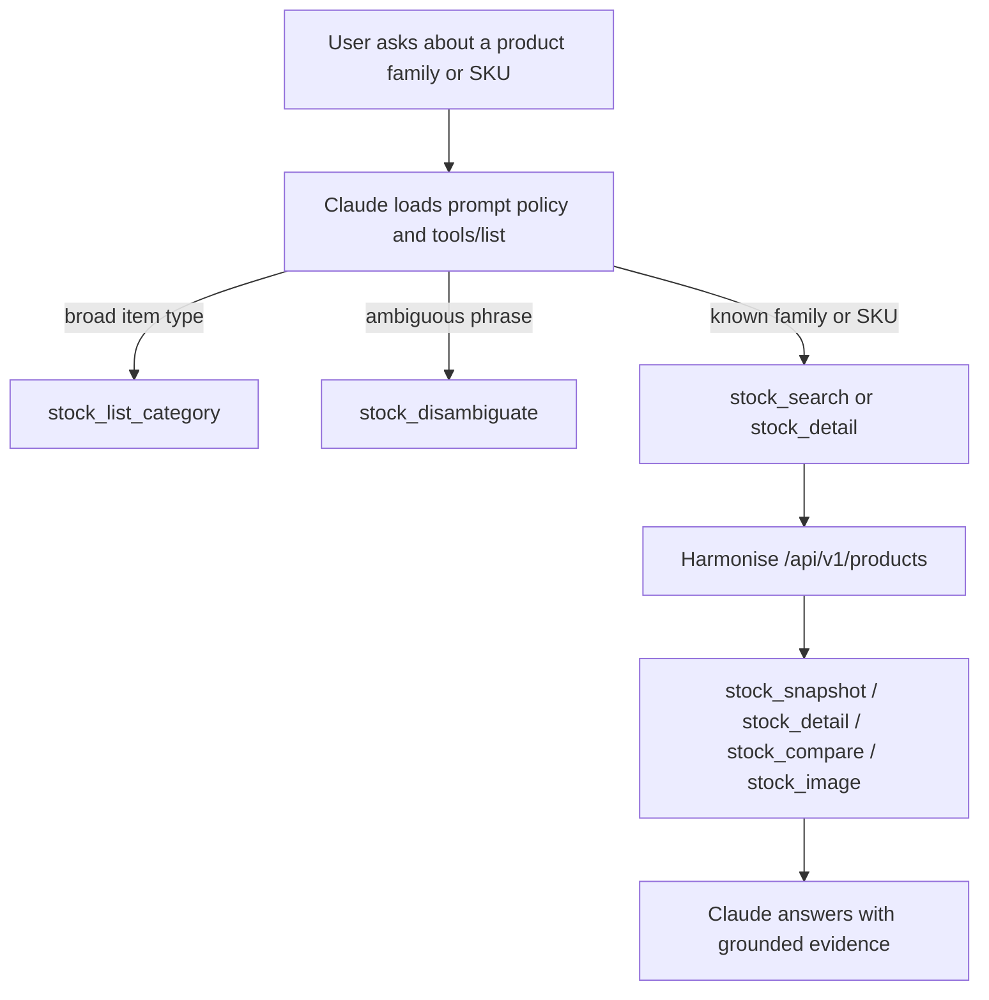
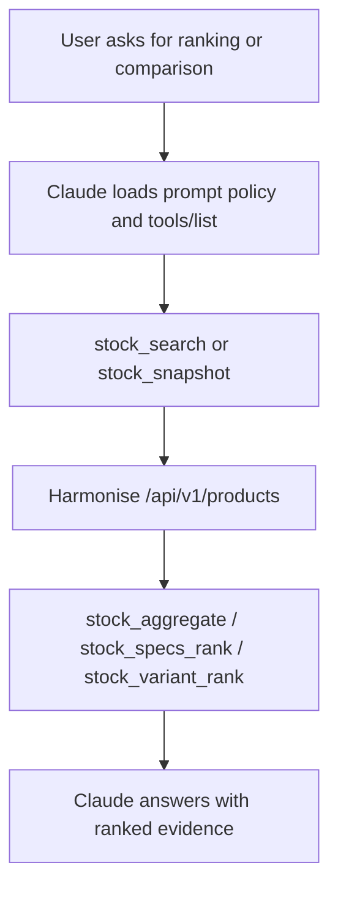
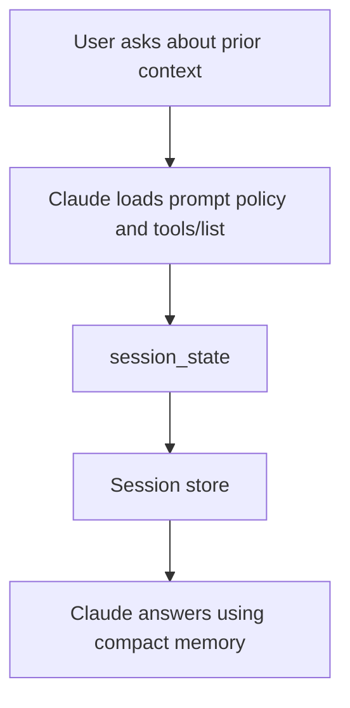

# MCP Tool Reference

## Tool Inventory

### Visible MCP tools

| Tool | Family | Purpose | When |
| --- | --- | --- | --- |
| `stock_scope` | Stock scope | Supported departments and mapped category routes | When the user asks what inventory scope exists, or before filtering by department/category |
| `stock_list_category` | Stock scope | Resolve a broad furniture phrase to a supported `categoryId` | When the user says “stools”, “coffee tables”, “ottomans”, or another broad item type |
| `stock_search` | Stock discovery | Find candidate products/families and SKUs | When the user names a product family and the assistant needs likely matches |
| `stock_disambiguate` | Stock discovery | Rank ambiguous catalogue matches or return clarification options | When one phrase could refer to several products or families |
| `stock_detail` | Stock discovery | Exact product-family or SKU detail | When the assistant already knows the exact product id or SKU |
| `stock_compare` | Stock discovery | Side-by-side comparison of resolved variants | When the user wants to compare two or more known variants |
| `stock_snapshot` | Stock evidence | Answer-ready family snapshot with variant rows | When the user asks for availability, sizes, stock, or hireable counts for a named family |
| `stock_aggregate` | Stock analytics | Grouped totals by product, category, variant, or department | When the user asks for most/least stock or grouped totals |
| `stock_specs_rank` | Stock analytics | Rank by stock, hirable, dimensions, area, volume, or pricing | When the question combines stock with specs, price, or attribute filters |
| `stock_variant_rank` | Stock analytics | Rank variants inside one product family | When the user wants to know which variant is “best”, “largest”, “most in stock”, etc. |
| `stock_image` | Stock evidence | Resolve and fetch a Harmonise product image | When the user explicitly wants product imagery |
| `session_state` | Session memory | Read the current session summary and memo | When the user asks about previous context or prior turns |
| `Non-stock Tools` | `news`, `weather`, `currency`  |
<!-- | `news_search` | News | Search News API articles | When the user asks for broad article search or coverage research |
| `news_headlines` | News | Fetch current headlines | When the user asks for top headlines by country, category, or source |
| `news_sources` | News | List News API source IDs | When the assistant needs valid sources for a later news call |
| `weather_current` | Weather | Current weather conditions | When the user asks “what is the weather in X right now?” |
| `weather_forecast` | Weather | 5-day / 3-hour forecast | When the user asks about upcoming weather |
| `weather_history` | Weather | Historical weather points | When the user asks about past conditions |
| `fx_symbols` | Currency | Supported currency codes | When the user needs valid currency symbols |
| `fx_latest` | Currency | Latest FX rates | When the user asks for current exchange rates |
| `fx_history` | Currency | Historical FX rates for one date | When the user asks for a rate on a specific day |
| `fx_series` | Currency | Daily FX time series | When the user wants a rate trend over time |
| `fx_convert` | Currency | Convert a value from one currency to another | When the user asks for a conversion amount |
| `fx_fluctuation` | Currency | Rate movement over a date range | When the user asks how much a currency moved | -->


## Stock Scope And Category Routing

These tools help Claude decide whether a request needs capability metadata, category resolution, or live inventory evidence.

### `stock_scope`

Purpose:
- Return the canonical supported department list and mapped furniture category routes.
- Use it for scope questions such as “how many departments do we support?” or “which category ids are valid?”

When called:
- The user asks about supported departments, supported categories, or available inventory scope.
- Claude needs a trusted `departmentId` or `categoryId` before a live stock request.

Example trigger:
- “Which `department/categories` are available?”
- "Let me know available `colours/size/...` of X item"


Response JSON:

```json
{
  "data": {
    "supported_department_count": 1,
    "supported_departments": [
      {
        "name": "Furniture",
        "department_id": 3,
        "description": "The only stock department currently supported by this assistant."
      }
    ],
    "mapped_furniture_category_count": 13,
    "mapped_furniture_categories": [
      {
        "name": "Furniture - Seating - Chairs",
        "category_id": "b7d70000-eacf-fc4c-c59a-08de7f19d85e",
        "description": "Upright chairs and similar seats that emphasize formal or dining use."
      },
      {
        "name": "Furniture - Seating - Stools",
        "category_id": "b7d70000-eacf-fc4c-0a24-08de7f19d8d2",
        "description": "High or low stools including bar, counter, and task stools."
      }
      ...
    ],
    "guidance": {
      "purpose": "Use this tool for supported stock scope, department/category counts, and categoryId routing. It is the MCP-visible source of truth for supported inventory capability.",
      "live_inventory": "For products, variants, or availability inside a category, use stock_snapshot or stock_aggregate with the returned department/category ids."
    }
  },
  "answer_ready": {
    "supported_department_count": 1,
    "supported_departments": [
      {
        "name": "Furniture",
        "department_id": 3,
        "description": "The only stock department currently supported by this assistant."
      }
    ],
    "mapped_furniture_category_count": 13,
    "mapped_furniture_categories": [
      {
        "name": "Furniture - Seating - Chairs",
        "category_id": "b7d70000-eacf-fc4c-c59a-08de7f19d85e",
        "description": "Upright chairs and similar seats that emphasize formal or dining use."
      }
      ...
    ],
    "guidance": {
      "purpose": "Use this tool for supported stock scope, department/category counts, and categoryId routing. It is the MCP-visible source of truth for supported inventory capability.",
      "live_inventory": "For products, variants, or availability inside a category, use stock_snapshot or stock_aggregate with the returned department/category ids."
    }
  },
  "normalization_notes": []
}
```

Response notes:
- `supported_department_count`: Number of supported departments.
- `supported_departments`: Human-readable supported departments and ids.
- `mapped_furniture_category_count`: Number of mapped furniture category routes.
- `mapped_furniture_categories`: Canonical category names, ids, and descriptions.
- `guidance`: Plain-language routing advice for the assistant.
- `answer_ready`: The same information in a compact assistant-facing form.

Real Harmonise request example:
- No Harmonise API call. This tool loads the current system supported department (guardrail from unsupported specs), list available categories (with id), and provide current system capability.

### `stock_list_category`

Purpose:
- Resolve a broad furniture term into one or more supported category ids.

When called:
- The user asks for a broad item type, category, or taxonomy-like phrase such as “stools”, “coffee tables”, or “ottomans”, etc.

Example trigger:
- “Let me know a few stools we have.”
- “What is the available item that we have for the ottoman chair.”

Request JSON:

```json
{
  "query": "stools",
  "departmentId": 3,
  "limit": 5
}
```

Parameter notes:
- `query`: The broad furniture phrase to resolve.
- `departmentId`: Furniture defaults to `3`; use another value only if the capability reference changes.
- `limit`: Maximum number of category matches to return.
Response JSON:

```json
{
  "data": {
    "query": "stools",
    "status": "matched",
    "matches": [
      {
        "categoryId": "b7d70000-eacf-fc4c-0a24-08de7f19d8d2",
        "name": "Furniture - Seating - Stools",
        "departmentId": 3,
        "description": "High or low stools including bar, counter, and task stools.",
        "confidence": 0.99,
        "matchedOn": ["token_overlap", "route_leaf", "phrase_substring", "fuzzy_name"]
      }
    ],
    "guidance": "Use the returned categoryId with stock_snapshot, stock_search, stock_aggregate, or ranking tools for broad item-type requests. If status is ambiguous, use the top likely category IDs for broad discovery or ask the user to choose when the meanings differ."
  },
  "answer_ready": {
    "query": "stools",
    "status": "matched",
    "matches": [
      {
        "categoryId": "b7d70000-eacf-fc4c-0a24-08de7f19d8d2",
        "name": "Furniture - Seating - Stools",
        "departmentId": 3,
        "description": "High or low stools including bar, counter, and task stools.",
        "confidence": 0.99,
        "matchedOn": ["token_overlap", "route_leaf", "phrase_substring", "fuzzy_name"]
      }
    ],
    "guidance": "Use the returned categoryId with stock_snapshot, stock_search, stock_aggregate, or ranking tools for broad item-type requests. If status is ambiguous, use the top likely category IDs for broad discovery or ask the user to choose when the meanings differ."
  },
  "normalization_notes": []
}
```

Response notes:
- `status`: `matched`, `ambiguous`, or `no_match`.
- `matches`: Ranked category candidates.
- `confidence`: Higher values mean a stronger match.
- `matchedOn`: Explains why the route matched.
- `guidance`: What to do next.

Real Harmonise request example:
- No Harmonise API call. This is a local category-routing helper.

### Hidden stock metadata tools

These tools only appear in local Harmonise mode and are hidden from normal MCP discovery.

- `stock_get_departments`: raw department metadata for local inspection.
- `stock_get_categories`: raw category metadata for local inspection.

Flow chart:



## Stock Discovery And Evidence

These tools turn a product phrase into grounded stock evidence.

<!--
Motivation vs Logic:
- Motivation: The old examples mixed real tool shapes with invented Harmonise product payloads, which made it harder to reason about what `/api/v1/products` actually returns.
- Logic: The examples below now anchor on two real catalogue responses (`Alto Chair` and `Arc Bar Table`). Long `items` and `variants` arrays are intentionally truncated to 2-3 representative rows followed by `...` so the docs stay readable without changing the upstream payload shape.
-->

### `stock_search`

Purpose:
- Find candidate product families and SKUs from Harmonise.

When called:
- The user names a product family and Claude needs matching catalogue rows.

Example trigger:
- “Let me know a few stools we have.”
- “How many colours and what are the dimensions of the Arc bar table?”

Request JSON:

```json
{
  "page": 1,
  "pageSize": 20,
  "search": "Alto chair",
  "departmentId": 3,
  "categoryId": "b7d70000-eacf-fc4c-c59a-08de7f19d85e"
}
```

Parameter notes:
- `page`: Catalogue page to start from.
- `search`: Product, family, or category phrase.
- `departmentId`: Supported department filter.
- `categoryId`: Supported category UUID from `stock_scope` or `stock_list_category`.

Response JSON:

```json
{
  "data": {
    "page": 1,
    "pageSize": 20,
    "totalCount": 1,
    "totalPages": 1,
    "items": [
      {
        "productGroupId": "4d070000-7379-b2d9-ca51-08de7f1ac388",
        "name": "Alto Chair",
        "departmentId": 3,
        "subDepartmentId": null,
        "categoryId": "b7d70000-eacf-fc4c-c59a-08de7f19d85e",
        "isActive": true,
        "variations": [
          {
            "variationId": "b7d70000-eacf-fc4c-f7b0-08de7f1ac218",
            "name": "Colour",
            "sortOrder": 0,
            "options": [
              {
                "optionId": "b7d70000-eacf-fc4c-f7b7-08de7f1ac218",
                "name": "Black",
                "sortOrder": 0
              },
              {
                "optionId": "b7d70000-eacf-fc4c-f7b9-08de7f1ac218",
                "name": "Blush",
                "sortOrder": 1
              },
              {
                "optionId": "b7d70000-eacf-fc4c-f7ba-08de7f1ac218",
                "name": "Sage Green",
                "sortOrder": 2
              },
              ...
            ]
          }
        ],
        "variants": [
          {
            "productId": "b7d70000-eacf-fc4c-f7fd-08de7f1ac218",
            "name": "Alto Chair  - Black",
            "sku": "fn-se-ch-alt-bla",
            "generalRate": 31.0,
            "expoRate": 62.0,
            "cost": 45.0,
            "vicStock": 127,
            "vicHirable": 112,
            "nswStock": 68,
            "nswHirable": 60,
            "qldStock": 0,
            "qldHirable": 0,
            "totalStock": 195,
            "totalHirable": 172,
            "imageThumbnailUri": "https://stsharedsalesdev6wbzr45g.blob.core.windows.net/stock/product-images/a444737e-96fa-449f-b1aa-90aad23b4173_thumb.png",
            "optionIds": ["b7d70000-eacf-fc4c-f7b7-08de7f1ac218"]
          },
          {
            "productId": "b7d70000-eacf-fc4c-f816-08de7f1ac218",
            "name": "Alto Chair  - Blush",
            "sku": "fn-se-ch-alt-blu",
            "generalRate": 31.0,
            "expoRate": 62.0,
            "cost": 45.0,
            "vicStock": 80,
            "vicHirable": 60,
            "nswStock": 20,
            "nswHirable": 17,
            "qldStock": 0,
            "qldHirable": 0,
            "totalStock": 100,
            "totalHirable": 77,
            "imageThumbnailUri": "https://stsharedsalesdev6wbzr45g.blob.core.windows.net/stock/product-images/0cb76216-98fd-4824-911f-c95845af2d98_thumb.png",
            "optionIds": ["b7d70000-eacf-fc4c-f7b9-08de7f1ac218"]
          },
          ...
        ]
      }
    ]
  },
  "answer_ready": {
    "page": 1,
    "pageSize": 20,
    "totalCount": 1,
    "totalPages": 1,
    "items": [
      {
        "productGroupId": "4d070000-7379-b2d9-ca51-08de7f1ac388",
        "name": "Alto Chair",
        "departmentId": 3,
        "subDepartmentId": null,
        "categoryId": "b7d70000-eacf-fc4c-c59a-08de7f19d85e",
        "isActive": true,
        "variationNames": ["Colour"],
        "variants": [
          {
            "productId": "b7d70000-eacf-fc4c-f7fd-08de7f1ac218",
            "name": "Alto Chair  - Black",
            "sku": "fn-se-ch-alt-bla",
            "totalHirable": 172
          },
          {
            "productId": "b7d70000-eacf-fc4c-f816-08de7f1ac218",
            "name": "Alto Chair  - Blush",
            "sku": "fn-se-ch-alt-blu",
            "totalHirable": 77
          }
        ]
      }
    ]
  },
  "normalization_notes": []
}
```

Response notes:
- `page`, `pageSize`, `totalCount`, `totalPages`: Standard paging metadata.
- `items`: Matching product families.
- `variationNames`: High-level variation group names.
- `variants`: Matching variants and SKUs.
- `variantCap`: Present only when the family has more variants than the tool shows.
- `answer_ready`: A compact version for the assistant.

Real Harmonise request example:

```text
GET /api/v1/products?page=1&pageSize=20&search=Alto%20chair&departmentId=3&categoryId=b7d70000-eacf-fc4c-c59a-08de7f19d85e
```

### `stock_disambiguate`

Purpose:
- Rank ambiguous catalogue candidates or return clarification options.

When called:
- The phrase could map to several product families, or Claude needs a safe clarification step before deeper retrieval.

Example trigger:
- “Show me Arc bar table options.”
- “I need the Arc table.”

Request JSON:

```json
{
  "query": "Arc bar table",
  "limit": 5,
  "departmentId": 3,
  "categoryId": "b7d70000-eacf-fc4c-61b4-08de7f1acabd"
}
```

Parameter notes:
- `query`: The ambiguous product phrase.
- `limit`: Number of candidates to return.
- `departmentId`: Optional supported department filter.
- `categoryId`: Optional supported category UUID.
Response JSON:

```json
{
  "data": {
    "status": "needs_clarification",
    "question": "Which Arc bar table did you mean?",
    "options": [
      {
        "candidate_id": "4d070000-7379-b2d9-dbdf-08de7f1b6880",
        "label": "Arc Bar Table",
        "confidence": 0.98,
        "matched_on": ["exact_product_name", "core_product_family"],
        "product_group_id": "4d070000-7379-b2d9-dbdf-08de7f1b6880",
        "sample_skus": ["fn-ta-ba-arc-1", "fn-ta-ba-arc-42", "fn-ta-ba-arc-119"],
        "evidence_summary": "Primary Arc Bar Table family with round and oblong variants, plus rim options."
      },
      {
        "candidate_id": "4d070000-7379-b2d9-a515-08de7f1b71e8",
        "label": "Arc Rectangular Bar Table",
        "confidence": 0.94,
        "matched_on": ["shared_product_prefix", "category_match"],
        "product_group_id": "4d070000-7379-b2d9-a515-08de7f1b71e8",
        "sample_skus": ["fn-ta-ba-arc-157-1", "fn-ta-ba-arc-157-4", "fn-ta-ba-arc-157-9"],
        "evidence_summary": "Separate Arc family focused on rectangular 150 x 70cm variants."
      }
    ],
    "total_matches": 2,
    "selection_mode": "select_option",
    "hints": ["Use the family name, SKU, or a shape/rim hint to narrow the request."]
  },
  "normalization_notes": []
}
```

Response notes:
- `status`: Either `needs_clarification` or `resolved_product_family`.
- `question`: Plain-language clarification prompt.
- `options`: Ranked candidate choices.
- `total_matches`: Total matching rows from the search.
- `selection_mode`: `select_option` or `refine_query`.
- `hints`: Suggested narrowing clues.

Real Harmonise request example:

```text
GET /api/v1/products?page=1&pageSize=20&search=Arc%20bar%20table&departmentId=3&categoryId=b7d70000-eacf-fc4c-61b4-08de7f1acabd
```

### `stock_detail`

Purpose:
- Return exact product-family or SKU detail, including variants, dimensions, pricing, and stock fields.

When called:
- The assistant already knows the product id or SKU.

Example trigger:
- “How many colours and what is the dimension the Arc bar table has?”

Request JSON:

```json
{
  "sku": "fn-ta-ba-arc-42",
  "page": 1
}
```

Parameter notes:
- `id`: Product-family UUID from a catalogue result.
- `sku`: Variant SKU. Preferred when known.
- `page`: Detail page to retrieve.
Response JSON:

```json
{
  "data": {
    "page": 1,
    "pageSize": 20,
    "totalCount": 1,
    "totalPages": 1,
    "items": [
      {
        "productGroupId": "4d070000-7379-b2d9-dbdf-08de7f1b6880",
        "name": "Arc Bar Table",
        "departmentId": 3,
        "subDepartmentId": null,
        "categoryId": "b7d70000-eacf-fc4c-61b4-08de7f1acabd",
        "isActive": true,
        "variations": [
          {
            "variationId": "ba6d9faf-7052-4417-8d98-c58f1a7dc17a",
            "name": "Colour",
            "sortOrder": 0,
            "options": [
              { "optionId": "f0d03750-2dc6-439f-8a70-d8b504520410", "name": "Black", "sortOrder": 0 },
              { "optionId": "ebebc134-fa9f-4d47-a3af-9d0e5e542046", "name": "White", "sortOrder": 1 },
              { "optionId": "9a8fa691-532f-435f-bda8-777d91ec8a8d", "name": "Gold", "sortOrder": 2 }
            ]
          },
          {
            "variationId": "011e0499-df85-4b0e-ae0c-b13dac048b0d",
            "name": "Shape",
            "sortOrder": 1,
            "options": [
              { "optionId": "d19ab04b-d1e4-4e1a-929b-9d41b02317b0", "name": "Rectangular", "sortOrder": 0 },
              { "optionId": "ec1144b7-bfd7-4c12-81d0-811657de399f", "name": "Round", "sortOrder": 1 }
            ]
          },
          {
            "variationId": "9b9577d3-7ee1-416f-b338-771e9b02c37d",
            "name": "Top Colour",
            "sortOrder": 2,
            "options": [
              { "optionId": "b77b2b8a-d47a-4976-8d29-fef268dd2be1", "name": "Black Marble Laminate", "sortOrder": 2 },
              { "optionId": "476c5588-aa22-42f8-b0b8-b11d916141ec", "name": "Black Timber Laminate", "sortOrder": 3 },
              { "optionId": "8b565927-d3e7-4bb7-ac77-41a1cc17669d", "name": "White Marble Laminate", "sortOrder": 4 },
              ...
            ]
          },
          ...
        ],
        "variants": [
          {
            "productId": "4d070100-7379-b2d9-502b-08de7f1b6881",
            "name": "Black Arc Bar Table - Black Rim - Black Timber Laminate Top - 120cm Round",
            "sku": "fn-ta-ba-arc-42",
            "generalRate": 350.0,
            "expoRate": 525.0,
            "cost": 357.0,
            "vicStock": 24,
            "vicHirable": 20,
            "nswStock": 10,
            "nswHirable": 8,
            "qldStock": 0,
            "qldHirable": 0,
            "totalStock": 34,
            "totalHirable": 28,
            "imageThumbnailUri": null,
            "optionIds": [
              "f0d03750-2dc6-439f-8a70-d8b504520410",
              "480bf30e-e11a-4104-8ecf-7d039c04d541",
              "ec1144b7-bfd7-4c12-81d0-811657de399f",
              "9f1634d5-c7ee-4863-858a-c5349caf1e44",
              "450cdffe-8a6b-4376-a7e5-582996c70f51",
              "542de062-77b7-4605-8342-f45bb6d721d6",
              "d9282764-4ae3-46cf-ab33-4a702fc8138e",
              "476c5588-aa22-42f8-b0b8-b11d916141ec"
            ]
          },
          {
            "productId": "4d070000-7379-b2d9-65b0-08de7f1b6881",
            "name": "Gold Arc Bar Table - Black Rim - Black Timber Laminate Top - 120cm Round",
            "sku": "fn-ta-ba-arc-54",
            "generalRate": 370.0,
            "expoRate": 555.0,
            "cost": 357.0,
            "vicStock": 24,
            "vicHirable": 20,
            "nswStock": 10,
            "nswHirable": 8,
            "qldStock": 0,
            "qldHirable": 0,
            "totalStock": 34,
            "totalHirable": 28,
            "imageThumbnailUri": null,
            "optionIds": [
              "480bf30e-e11a-4104-8ecf-7d039c04d541",
              "ec1144b7-bfd7-4c12-81d0-811657de399f",
              "9a8fa691-532f-435f-bda8-777d91ec8a8d",
              "9f1634d5-c7ee-4863-858a-c5349caf1e44",
              "450cdffe-8a6b-4376-a7e5-582996c70f51",
              "542de062-77b7-4605-8342-f45bb6d721d6",
              "d9282764-4ae3-46cf-ab33-4a702fc8138e",
              "476c5588-aa22-42f8-b0b8-b11d916141ec"
            ]
          }
        ]
      }
    ]
  },
  "answer_ready": {
    "page": 1,
    "pageSize": 20,
    "totalCount": 1,
    "totalPages": 1,
    "items": [
      {
        "productGroupId": "4d070000-7379-b2d9-dbdf-08de7f1b6880",
        "name": "Arc Bar Table",
        "departmentId": 3,
        "subDepartmentId": null,
        "categoryId": "b7d70000-eacf-fc4c-61b4-08de7f1acabd",
        "isActive": true,
        "variationNames": ["Colour", "Shape", "Top Colour", "Rim Colour", "Rim Shape", "Rim Size"],
        "variants": [
          {
            "productId": "4d070100-7379-b2d9-502b-08de7f1b6881",
            "name": "Black Arc Bar Table - Black Rim - Black Timber Laminate Top - 120cm Round",
            "sku": "fn-ta-ba-arc-42",
            "totalHirable": 28
          }
        ]
      }
    ],
    "guidance": "Use the returned family/variant payload to summarize real colour, rim, shape, and top options. Trim the variant list in user-facing answers when the family is large."
  },
  "normalization_notes": []
}
```

Response notes:
- `details`: The richest fields for dimensions, pricing, and state stock.
- `imageFileName` / `imageUrl`: Image metadata for the variant.
- `answer_ready`: A compact assistant-facing version.

Real Harmonise request example:

```text
GET /api/v1/products?page=1&pageSize=10&search=Arc%20bar%20table
```

### `stock_snapshot`

Purpose:
- Return an answer-ready snapshot of variant rows for a named family or broader product search.

Catalogue policy:
- **Requires at least one of** `search`, `departmentId`, or `categoryId` (same as `stock_search`) so Harmonise is never called as an unfiltered full-catalogue list.
- Catalogue list pagination is **capped** per `HTH_SNAPSHOT_EXPAND_MAX_DEPARTMENT_PAGES` (default **10**) for both the initial snapshot scan and the optional category expansion pass. When Harmonise reports more pages, `coverage.isPartial` is true and `coverage.limitations` includes guidance to ask the user for a narrower scope.
- When expansion runs with `search` plus `categoryId`, a follow-up Harmonise list call may use **`search` omitted** but still passes **`departmentId` and `categoryId`** to stay category-scoped (not the same as a bare `?page=&pageSize=` request).

When called:
- The user asks for availability, dimensions, hireable stock, or a family summary.

Example trigger:
- “Let me know a few stools we have.”
- “Tell me about the Alto chair stock availability.”

Request JSON:

```json
{
  "page": 1,
  "search": "Alto chair",
  "departmentId": 3,
  "categoryId": "b7d70000-eacf-fc4c-c59a-08de7f19d85e"
}
```

Parameter notes:
- `page`: Catalogue page to start from.
- `search`: Product or family phrase.
- `departmentId`: Supported department filter.
- `categoryId`: Supported category UUID when the category is clear.
- At least one of `search`, `departmentId`, or `categoryId` must be set; omitting all three is a validation error.

Response JSON:

```json
{
  "data": {
    "rows": [
      {
        "product": "Alto Chair",
        "variant": "Alto Chair  - Black",
        "sku": "fn-se-ch-alt-bla",
        "attributeEvidence": ["Black", "Alto Chair"],
        "size": null,
        "stock": "Overall has 195 in stock, with 172 available for hire. By location: VIC has 127 in stock, with 112 available for hire; NSW has 68 in stock, with 60 available for hire.",
        "knownSpecs": ["colour: Black"]
      },
      {
        "product": "Alto Chair",
        "variant": "Alto Chair  - Blush",
        "sku": "fn-se-ch-alt-blu",
        "attributeEvidence": ["Blush", "Alto Chair"],
        "size": null,
        "stock": "Overall has 100 in stock, with 77 available for hire. By location: VIC has 80 in stock, with 60 available for hire; NSW has 20 in stock, with 17 available for hire.",
        "knownSpecs": ["colour: Blush"]
      }
    ],
    "coverage": {
      "requestedPage": 1,
      "requestedPageSize": 20,
      "matchedProducts": 1,
      "matchedPages": 1,
      "enrichedProducts": 1,
      "enrichedVariants": 1,
      "isPartial": false,
      "limitations": [],
      "variantCaps": []
    },
    "evidence": [
      {
        "product": "Alto Chair",
        "variant": "Alto Chair  - Black",
        "sku": "fn-se-ch-alt-bla",
        "variationOptions": ["Black"],
        "dimensions": {
          "dimensional": null,
          "canBeSoldInPortions": null,
          "length": null,
          "width": null,
          "height": null
        },
        "stock": {
          "totalHirable": 172,
          "vicStock": 127,
          "vicHirable": 112,
          "nswStock": 68,
          "nswHirable": 60,
          "qldStock": 0,
          "qldHirable": 0,
          "totalStock": 195
        },
        "pricing": {
          "generalRate": 31.0,
          "expoRate": 62.0,
          "cost": 45.0
        },
        "salesNote": null,
        "media": {
          "imageFileName": null,
          "imageUrl": "https://stsharedsalesdev6wbzr45g.blob.core.windows.net/stock/product-images/a444737e-96fa-449f-b1aa-90aad23b4173_thumb.png"
        }
      },
      {
        "product": "Alto Chair",
        "variant": "Alto Chair  - Blush",
        "sku": "fn-se-ch-alt-blu",
        "variationOptions": ["Blush"],
        "dimensions": {
          "dimensional": null,
          "canBeSoldInPortions": null,
          "length": null,
          "width": null,
          "height": null
        },
        "stock": {
          "totalHirable": 77,
          "vicStock": 80,
          "vicHirable": 60,
          "nswStock": 20,
          "nswHirable": 17,
          "qldStock": 0,
          "qldHirable": 0,
          "totalStock": 100
        },
        "pricing": {
          "generalRate": 31.0,
          "expoRate": 62.0,
          "cost": 45.0
        },
        "salesNote": null,
        "media": {
          "imageFileName": null,
          "imageUrl": "https://stsharedsalesdev6wbzr45g.blob.core.windows.net/stock/product-images/0cb76216-98fd-4824-911f-c95845af2d98_thumb.png"
        }
      }
    ],
    "guidance": "Answer-ready inventory snapshot for a named product family."
  },
  "answer_ready": {
    "rows": [
      {
        "product": "Alto Chair",
        "variant": "Alto Chair  - Black",
        "sku": "fn-se-ch-alt-bla",
        "attributeEvidence": ["Black", "Alto Chair"],
        "size": null,
        "stock": "Overall has 195 in stock, with 172 available for hire. By location: VIC has 127 in stock, with 112 available for hire; NSW has 68 in stock, with 60 available for hire.",
        "knownSpecs": ["colour: Black"],
        "variationOptions": ["Black"],
        "pricing": {
          "generalRate": 31.0,
          "expoRate": 62.0,
          "cost": 45.0
        },
        "stockNumbers": {
          "totalHirable": 172,
          "vicStock": 127,
          "vicHirable": 112,
          "nswStock": 68,
          "nswHirable": 60,
          "qldStock": 0,
          "qldHirable": 0,
          "totalStock": 195
        }
      }
    ],
    "coverage": {
      "requestedPage": 1,
      "requestedPageSize": 20,
      "matchedProducts": 1,
      "matchedPages": 1,
      "enrichedProducts": 1,
      "enrichedVariants": 1,
      "isPartial": false,
      "limitations": [],
      "variantCaps": []
    },
    "evidence": [
      {
        "product": "Alto Chair",
        "variant": "Alto Chair  - Black",
        "sku": "fn-se-ch-alt-bla",
        "variationOptions": ["Black"],
        "dimensions": {
          "dimensional": null,
          "canBeSoldInPortions": null,
          "length": null,
          "width": null,
          "height": null
        },
        "stock": {
          "totalHirable": 172,
          "vicStock": 127,
          "vicHirable": 112,
          "nswStock": 68,
          "nswHirable": 60,
          "qldStock": 0,
          "qldHirable": 0,
          "totalStock": 195
        },
        "pricing": {
          "generalRate": 31.0,
          "expoRate": 62.0,
          "cost": 45.0
        },
        "salesNote": null,
        "media": {
          "imageFileName": null,
          "imageUrl": "https://stsharedsalesdev6wbzr45g.blob.core.windows.net/stock/product-images/a444737e-96fa-449f-b1aa-90aad23b4173_thumb.png"
        }
      }
    ],
    "guidance": "Answer-ready inventory snapshot for a named product family."
  },
  "normalization_notes": []
}
```

Response notes:
- `rows`: User-facing stock rows.
- `coverage`: Whether the snapshot is complete or partial.
- `evidence`: Rich normalized evidence for downstream reasoning.
- `guidance`: A short instruction for the assistant.

Real Harmonise request example:

```text
GET /api/v1/products?page=1&pageSize=20&search=Alto%20chair&departmentId=3&categoryId=b7d70000-eacf-fc4c-c59a-08de7f19d85e
```

### `stock_compare`

Purpose:
- Compare already-resolved variants or identifiers.

When called:
- The user wants a side-by-side comparison of variants that are already known.

Example trigger:
- “Compare `fn-se-ch-alt-bla` and `fn-se-ch-alt-blu`.” - *Note: SKU codes should already be resolved by `stock_snapshot` or `stock_detail`.*

Request JSON:

```json
{
  "identifiers": ["fn-se-ch-alt-bla", "fn-se-ch-alt-blu"]
}
```

Parameter notes:
- `identifiers`: Two to twenty known SKUs or identifiers.
Response JSON:

```json
{
  "data": [
    {
      "product": "Alto Chair",
      "variant": "Alto Chair  - Black",
      "sku": "fn-se-ch-alt-bla",
      "variationOptions": ["Black"],
      "salesNote": null,
      "dimensions": {
        "dimensional": null,
        "canBeSoldInPortions": null,
        "length": null,
        "width": null,
        "height": null
      },
      "stock": {
        "totalHirable": 172,
        "vicStock": 127,
        "vicHirable": 112,
        "nswStock": 68,
        "nswHirable": 60,
        "qldStock": 0,
        "qldHirable": 0,
        "totalStock": 195
      },
      "pricing": {
        "generalRate": 31.0,
        "expoRate": 62.0,
        "cost": 45.0
      },
      "media": {
        "imageFileName": null,
        "imageUrl": "https://stsharedsalesdev6wbzr45g.blob.core.windows.net/stock/product-images/a444737e-96fa-449f-b1aa-90aad23b4173_thumb.png"
      },
      "isActive": true,
      "provenance": {
        "tool": "stock_compare_variants",
        "matched_on": ["identifier"],
        "confidence": 0.99,
        "source_path": "items[0].variants[0]"
      }
    },
    {
      "product": "Alto Chair",
      "variant": "Alto Chair  - Blush",
      "sku": "fn-se-ch-alt-blu",
      "variationOptions": ["Blush"],
      "salesNote": null,
      "dimensions": {
        "dimensional": null,
        "canBeSoldInPortions": null,
        "length": null,
        "width": null,
        "height": null
      },
      "stock": {
        "totalHirable": 77,
        "vicStock": 80,
        "vicHirable": 60,
        "nswStock": 20,
        "nswHirable": 17,
        "qldStock": 0,
        "qldHirable": 0,
        "totalStock": 100
      },
      "pricing": {
        "generalRate": 31.0,
        "expoRate": 62.0,
        "cost": 45.0
      },
      "media": {
        "imageFileName": null,
        "imageUrl": "https://stsharedsalesdev6wbzr45g.blob.core.windows.net/stock/product-images/0cb76216-98fd-4824-911f-c95845af2d98_thumb.png"
      },
      "isActive": true,
      "provenance": {
        "tool": "stock_compare_variants",
        "matched_on": ["identifier"],
        "confidence": 0.99,
        "source_path": "items[0].variants[1]"
      }
    }
  ],
  "answer_ready": [
    { "...": "same normalized evidence, trimmed for brevity" }
  ],
  "normalization_notes": []
}
```

Response notes:
- `data`: A list of normalized evidence objects in the same order as the request identifiers.
- `answer_ready`: The assistant-facing version of the same evidence.

Real Harmonise request example:

```text
GET /api/v1/products/fn-se-ch-alt-bla
GET /api/v1/products/fn-se-ch-alt-blu
...
```

### `stock_image`

Purpose:
- Resolve a product image and, when possible, return both the image URL and MCP-native image content.

When called:
- The user explicitly wants a product image or visual confirmation.

Example trigger:
- “Show me the Alto chair image.”

Request JSON:

```json
{
  "sku": "fn-se-ch-alt-bla",
  "page": 1
}
```

Parameter notes:
- `imageFileName`: Exact image path when already known.
- `sku`: Variant SKU when the image should be resolved from product detail.
- `search`: Product/family search when neither image path nor SKU is known.
- `departmentId`: Optional supported department filter.
- `categoryId`: Optional supported category UUID.
- `page`: Catalogue page to start from before search-based image resolution.
Response JSON:

```json
{
  "data": {
    "source": "sku",
    "query": null,
    "sku": "fn-se-ch-alt-bla",
    "product": "Alto Chair",
    "variant": "Alto Chair  - Black",
    "imageFileName": null,
    "imageUrl": "https://stsharedsalesdev6wbzr45g.blob.core.windows.net/stock/product-images/a444737e-96fa-449f-b1aa-90aad23b4173_thumb.png",
    "resolutionNotes": [],
    "coverage": {
      "requestedPage": 1,
      "requestedPageSize": 20,
      "isPartial": false,
      "limitations": []
    },
    "guidance": "Use this tool when the user explicitly needs a Harmonise product image. It can resolve from an exact image path, exact SKU, or a product-family search, and it returns both the HTTP image URL and MCP-native image content when binary fetch succeeds."
  },
  "answer_ready": {
    "source": "sku",
    "query": null,
    "sku": "fn-se-ch-alt-bla",
    "product": "Alto Chair",
    "variant": "Alto Chair  - Black",
    "imageFileName": null,
    "imageUrl": "https://stsharedsalesdev6wbzr45g.blob.core.windows.net/stock/product-images/a444737e-96fa-449f-b1aa-90aad23b4173_thumb.png",
    "resolutionNotes": [],
    "coverage": {
      "requestedPage": 1,
      "requestedPageSize": 20,
      "isPartial": false,
      "limitations": []
    },
    "guidance": "Use this tool when the user explicitly needs a Harmonise product image. It can resolve from an exact image path, exact SKU, or a product-family search, and it returns both the HTTP image URL and MCP-native image content when binary fetch succeeds."
  },
  "normalization_notes": []
}
```

Response notes:
- `imageUrl`: The HTTP image URL that the assistant can cite.
- `mcp_content`: If the image fetch succeeds, MCP may attach binary image content outside the JSON body.
- `rendering`: Browser and desktop fallback instructions when the host does not display native MCP image content. Follow `fallbackOrder`: encoded MCP image content, automatic local download of the resolved URI, automatic preview command that creates and activates its script environment, then best URI only with an AI client rendering-issue explanation.
- Thumbnail URLs are fetched as high-resolution candidates first by stripping `_thumb`, then trying `.jpg` and `.jpeg`, before falling back to the original thumbnail URL.
- `coverage`: Whether image resolution was partial.

Real Harmonise request example:

```text
GET /api/v1/products/fn-se-ch-alt-bla
```

Flow chart:



## Stock Analytics

These tools rank or group product evidence after the family is known.

### `stock_aggregate`

Purpose:
- Group and rank totals by product, category, or variant.

When called:
- The user asks “which has the most stock?”, “least stock?”, or grouped totals by family, type, or state.

Example trigger:
- “Which Alto chair variant has the most stock in NSW?”

Request JSON:

```json
{
  "search": "Alto chair",
  "region": "NSW",
  "measure": "stock",
  "groupBy": "variant",
  "direction": "most",
  "limit": 10,
  "departmentId": 3,
  "categoryId": "b7d70000-eacf-fc4c-c59a-08de7f19d85e"
}
```

Parameter notes:
- `search`: Product, family, or category phrase; may be omitted only when `departmentId` and/or `categoryId` scopes the catalogue.
- `region`: `VIC`, `NSW`, `QLD`, or `overall`.
- `measure`: `stock` or `hirable`.
- `groupBy`: `product`, `category`, or `variant`.
- `direction`: `most` or `least`.
- `limit`: Maximum number of ranked groups.
- `departmentId`: Supported department filter (or combine with `search` / `categoryId`).
- `categoryId`: Supported category UUID (or combine with `search` / `departmentId`).
- At least one of `search`, `departmentId`, or `categoryId` must be set (same policy as `stock_snapshot`).

Response JSON:

```json
{
  "data": {
    "query": "Alto chair",
    "region": "NSW",
    "measure": "stock",
    "groupBy": "variant",
    "direction": "most",
    "rows": [
      {
        "rank": 1,
        "group": "Alto Chair  - Black",
        "groupBy": "variant",
        "region": "NSW",
        "measure": "stock",
        "rankValue": 68,
        "stock": { "overall": 195, "VIC": 127, "NSW": 68, "QLD": 0 },
        "hirable": { "overall": 172, "VIC": 112, "NSW": 60, "QLD": 0 },
        "variantCount": 1,
        "productIds": ["b7d70000-eacf-fc4c-f7fd-08de7f1ac218"],
        "categoryIds": ["b7d70000-eacf-fc4c-c59a-08de7f19d85e"],
        "variants": [
          {
            "product": "Alto Chair",
            "variant": "Alto Chair  - Black",
            "sku": "fn-se-ch-alt-bla",
            "stock": 68,
            "hirable": 60
          }
        ],
        "missingStockFields": []
      },
      {
        "rank": 2,
        "group": "Alto Chair  - Blush",
        "groupBy": "variant",
        "region": "NSW",
        "measure": "stock",
        "rankValue": 20,
        "stock": { "overall": 100, "VIC": 80, "NSW": 20, "QLD": 0 },
        "hirable": { "overall": 77, "VIC": 60, "NSW": 17, "QLD": 0 },
        "variantCount": 1,
        "productIds": ["b7d70000-eacf-fc4c-f816-08de7f1ac218"],
        "categoryIds": ["b7d70000-eacf-fc4c-c59a-08de7f19d85e"],
        "variants": [
          {
            "product": "Alto Chair",
            "variant": "Alto Chair  - Blush",
            "sku": "fn-se-ch-alt-blu",
            "stock": 20,
            "hirable": 17
          }
        ],
        "missingStockFields": []
      }
    ],
    "coverage": {
      "requestedPage": 1,
      "requestedPageSize": 20,
      "matchedProducts": 1,
      "matchedPages": 1,
      "enrichedProducts": 1,
      "enrichedVariants": 1,
      "isPartial": false,
      "limitations": [],
      "variantCaps": []
    },
    "guidance": "Rows are grouped at the requested grain. Use `variant` when the user is asking about specific Alto Chair colourways rather than the whole family."
  },
  "answer_ready": {
    "...": "same grouped result, ready for the assistant"
  },
  "normalization_notes": []
}
```

Response notes:
- `rows`: Grouped totals.
- `rankValue`: The value used for ranking.
- `stock` / `hirable`: Aggregated totals by region.
- `variants`: The variants that contributed to each group.
- `coverage`: Whether aggregation was partial.

Real Harmonise request example:

```text
GET /api/v1/products?page=1&pageSize=20&search=Alto%20chair&departmentId=3&categoryId=b7d70000-eacf-fc4c-c59a-08de7f19d85e
```

### `stock_specs_rank`

Purpose:
- Rank products or variants by stock, hirable availability, physical size, area, volume, or pricing.

When called:
- The user combines stock with dimensions, price, or another measurable attribute.

Example trigger:
- “Which bar tables are largest and still have stock?”

Request JSON:

```json
{
  "search": "Arc bar table",
  "departmentId": 3,
  "categoryId": "b7d70000-eacf-fc4c-61b4-08de7f1acabd",
  "region": "overall",
  "metric": "generalRate",
  "groupBy": "variant",
  "direction": "most",
  "attributeFilters": [
    {
      "field": "variantName",
      "value": "gold rim",
      "matchMode": "contains"
    }
  ],
  "limit": 10,
  "page": 1
}
```

Parameter notes:
- `search`: Family, category, style, or product phrase.
- `departmentId`: Department filter.
- `categoryId`: Category UUID filter.
- `region`: `VIC`, `NSW`, `QLD`, or `overall`.
- `metric`: Stock, hirable, dimensions, area, volume, or pricing metric.
- `groupBy`: `product`, `category`, `department`, or `variant`.
- `direction`: `most` or `least`.
- `attributeFilters`: Extra LLM-supplied filters.
- `limit`: Maximum ranked rows.
- `page`: Snapshot start page.
Response JSON:

```json
{
  "data": {
    "query": "Arc bar table",
    "region": "overall",
    "metric": "generalRate",
    "groupBy": "variant",
    "direction": "most",
    "attributeFilters": [
      {
        "field": "variantName",
        "value": "gold rim",
        "matchMode": "contains"
      }
    ],
    "rows": [
      {
        "rank": 1,
        "group": "Gold Arc Bar Table - Gold Rim - Black Timber Laminate Top - 75 x 160cm Oblong",
        "groupBy": "variant",
        "region": "overall",
        "measure": "generalRate",
        "rankValue": 395.0,
        "stock": { "overall": 26, "VIC": 20, "NSW": 6, "QLD": 0 },
        "hirable": { "overall": 23, "VIC": 18, "NSW": 5, "QLD": 0 },
        "variantCount": 1,
        "productIds": ["4d070100-7379-b2d9-dfa2-08de7f1b6882"],
        "categoryIds": ["b7d70000-eacf-fc4c-61b4-08de7f1acabd"],
        "variants": [
          {
            "product": "Arc Bar Table",
            "variant": "Gold Arc Bar Table - Gold Rim - Black Timber Laminate Top - 75 x 160cm Oblong",
            "sku": "fn-ta-ba-arc-150",
            "stock": 26,
            "hirable": 23
          }
        ],
        "missingStockFields": []
      },
      {
        "rank": 2,
        "group": "Gold Arc Bar Table - Gold Rim - Black Marble Laminate Top - 75 x 160cm Oblong",
        "groupBy": "variant",
        "region": "overall",
        "measure": "generalRate",
        "rankValue": 395.0,
        "stock": { "overall": 26, "VIC": 20, "NSW": 6, "QLD": 0 },
        "hirable": { "overall": 23, "VIC": 18, "NSW": 5, "QLD": 0 },
        "variantCount": 1,
        "productIds": ["4d070000-7379-b2d9-e50a-08de7f1b6882"],
        "categoryIds": ["b7d70000-eacf-fc4c-61b4-08de7f1acabd"],
        "variants": [
          {
            "product": "Arc Bar Table",
            "variant": "Gold Arc Bar Table - Gold Rim - Black Marble Laminate Top - 75 x 160cm Oblong",
            "sku": "fn-ta-ba-arc-151",
            "stock": 26,
            "hirable": 23
          }
        ],
        "missingStockFields": []
      }
    ],
    "coverage": {
      "requestedPage": 1,
      "requestedPageSize": 20,
      "matchedProducts": 1,
      "matchedPages": 1,
      "enrichedProducts": 1,
      "enrichedVariants": 1,
      "isPartial": false,
      "limitations": [],
      "variantCaps": [],
      "filteredVariants": 2
    },
    "guidance": "Rows are ranked from Harmonise normalized evidence. This example uses real Arc Bar Table pricing because dimensions are not present in the `/api/v1/products` search payload shown above."
  },
  "answer_ready": {
    "...": "same grouped ranking result, ready for the assistant"
  },
  "normalization_notes": []
}
```

Response notes:
- `attributeFilters`: The filters that were applied.
- `rows`: Ranked result rows.
- `coverage.filteredVariants`: How many variants matched after filtering.

Real Harmonise request example:

```text
GET /api/v1/products?page=1&pageSize=10&search=Arc%20bar%20table&departmentId=3&categoryId=b7d70000-eacf-fc4c-61b4-08de7f1acabd
```

### `stock_variant_rank`

Purpose:
- Rank variants within one resolved family.

When called:
- The assistant knows the family and the user wants the best matching variant.

Example trigger:
- “Which Alto chair variant is most in stock in Victoria?”

Request JSON:

```json
{
  "page": 1,
  "search": "Alto chair",
  "departmentId": 3,
  "categoryId": "b7d70000-eacf-fc4c-c59a-08de7f19d85e",
  "region": "VIC",
  "metric": "stock",
  "direction": "most",
  "attributeFilters": [],
  "limit": 10
}
```

Parameter notes:
- `page`: Snapshot start page.
- `search`: Family phrase.
- `departmentId`: Department filter.
- `categoryId`: Category UUID filter.
- `region`: State or overall region.
- `metric`: Stock, hirable, dimension, area, volume, or pricing metric.
- `direction`: `most` or `least`.
- `attributeFilters`: Optional filters.
- `limit`: Maximum rows.
Response JSON:

```json
{
  "data": {
    "query": "Alto chair",
    "region": "VIC",
    "metric": "stock",
    "direction": "most",
    "attributeFilters": [],
    "rows": [
      {
        "rank": 1,
        "group": "Alto Chair  - Black",
        "groupBy": "variant",
        "region": "VIC",
        "measure": "stock",
        "rankValue": 127,
        "stock": { "overall": 195, "VIC": 127, "NSW": 68, "QLD": 0 },
        "hirable": { "overall": 172, "VIC": 112, "NSW": 60, "QLD": 0 },
        "variantCount": 1,
        "productIds": ["b7d70000-eacf-fc4c-f7fd-08de7f1ac218"],
        "categoryIds": ["b7d70000-eacf-fc4c-c59a-08de7f19d85e"],
        "variants": [
          {
            "product": "Alto Chair",
            "variant": "Alto Chair  - Black",
            "sku": "fn-se-ch-alt-bla",
            "stock": 127,
            "hirable": 112
          }
        ],
        "missingStockFields": []
      },
      {
        "rank": 2,
        "group": "Alto Chair  - Blush",
        "groupBy": "variant",
        "region": "VIC",
        "measure": "stock",
        "rankValue": 80,
        "stock": { "overall": 100, "VIC": 80, "NSW": 20, "QLD": 0 },
        "hirable": { "overall": 77, "VIC": 60, "NSW": 17, "QLD": 0 },
        "variantCount": 1,
        "productIds": ["b7d70000-eacf-fc4c-f816-08de7f1ac218"],
        "categoryIds": ["b7d70000-eacf-fc4c-c59a-08de7f19d85e"],
        "variants": [
          {
            "product": "Alto Chair",
            "variant": "Alto Chair  - Blush",
            "sku": "fn-se-ch-alt-blu",
            "stock": 80,
            "hirable": 60
          }
        ],
        "missingStockFields": []
      }
    ],
    "coverage": {
      "requestedPage": 1,
      "requestedPageSize": 20,
      "matchedProducts": 1,
      "matchedPages": 1,
      "enrichedProducts": 1,
      "enrichedVariants": 1,
      "isPartial": false,
      "limitations": [],
      "variantCaps": [],
      "filteredVariants": 1
    },
    "guidance": "Rows are ranked only at variant grain within the resolved product family/families. Use this tool to resolve which variant best matches the requested stock/spec metric after the family is known."
  },
  "answer_ready": {
    "...": "same variant ranking result, ready for the assistant"
  },
  "normalization_notes": []
}
```

Response notes:
- `rows`: Variants ranked within the family.
- `groupBy`: Usually `variant`.
- `coverage.filteredVariants`: Number of variants that survived filtering.

Real Harmonise request example:

```text
GET /api/v1/products?page=1&pageSize=20&search=Alto%20chair&departmentId=3&categoryId=b7d70000-eacf-fc4c-c59a-08de7f19d85e
```

Flow chart:



## Session Memory

### `session_state`

Purpose:
- Read the compact session summary, memo, candidate list, and recent context.

When called:
- Only when the user explicitly asks about prior context, memory, or earlier turns.

Example trigger:
- “What did I ask about earlier?”

Request JSON:

```json
{
  "sessionId": "sess-1842"
}
```

Parameter notes:
- `sessionId`: Optional explicit session id.

Response JSON:

```json
{
  "data": {
    "session_id": "sess-1842",
    "session_name": "Alto chair follow-up",
    "session_name_source": "llm",
    "name_assigned": true,
    "recent_product_names": ["Alto Chair", "Arc Bar Table"],
    "recent_resolved_identifiers": ["fn-se-ch-alt-bla", "fn-ta-ba-arc-42"],
    "last_candidate_list": [
      {
        "candidate_id": "4d070000-7379-b2d9-dbdf-08de7f1b6880",
        "label": "Arc Bar Table",
        "confidence": 0.98,
        "matched_on": ["exact_product_name", "core_product_family"],
        "product_group_id": "4d070000-7379-b2d9-dbdf-08de7f1b6880",
        "sample_skus": ["fn-ta-ba-arc-1", "fn-ta-ba-arc-42", "fn-ta-ba-arc-119"],
        "evidence_summary": "Primary Arc Bar Table family with round and oblong variants, plus rim options."
      }
    ],
    "last_filters": {
      "departmentId": 3,
      "categoryId": "b7d70000-eacf-fc4c-c59a-08de7f19d85e"
    },
    "preferences": {},
    "plan": {
      "...": "compact plan summary"
    },
    "memo": {
      "...": "compact memo summary"
    },
    "conversation": {
      "...": "compact conversation summary"
    },
    "summary": "Session snapshot for sess-1842"
  },
    "answer_ready": {
      "session_id": "sess-1842",
      "session_name": "Alto chair follow-up",
    "session_name_source": "llm",
    "name_assigned": true,
    "summary": "Session snapshot for sess-1842"
  },
  "normalization_notes": []
}
```

Response notes:
- `recent_product_names`: Recent product-family mentions.
- `recent_resolved_identifiers`: Recently resolved ids or SKUs.
- `last_candidate_list`: Most recent clarification candidates.
- `plan`, `memo`, `conversation`: Compact context summaries.
- `summary`: Plain-language session snapshot.

Hidden aliases:
- `session_get_state` behaves the same as `session_state`.
- `session_clear_state` clears the session memory and is hidden from normal discovery.

Flow chart:




---

<!--

# Non-stock Tools

## News

These tools reach the external News API and return both raw data and a concise summary.

### `news_search`

Purpose:
- Search News API articles by keyword, source, domain, date, or language.

When called:
- The user asks for broader research, coverage, or article search.

Example trigger:
- “What are the latest headlines about office furniture?”

Request JSON:

```json
{
  "q": "office furniture",
  "searchIn": "title,description",
  "sources": null,
  "domains": "news.com.au,smh.com.au",
  "excludeDomains": null,
  "from": "2026-05-01T00:00:00Z",
  "to": "2026-05-05T23:59:59Z",
  "language": "en",
  "sortBy": "publishedAt",
  "pageSize": 10,
  "page": 1
}
```

Parameter notes:
- `q`: Free-text keyword search.
- `searchIn`: Comma-separated fields to search.
- `sources`: Comma-separated News API source IDs.
- `domains`: Domains to include.
- `excludeDomains`: Domains to exclude.
- `from`: Oldest publication time.
- `to`: Newest publication time.
- `language`: Two-letter language code.
- `sortBy`: Result ordering.
- `pageSize`: Number of articles to return.
- `page`: Result page.

Response JSON:

```json
{
  "data": {
    "status": "ok",
    "totalResults": 2,
    "articles": [
      {
        "source": { "id": "smh", "name": "The Sydney Morning Herald" },
        "author": "Jane Reporter",
        "title": "Office furniture demand rises",
        "description": "Demand for seating and tables has increased across events and workplaces.",
        "url": "https://example.com/article-1",
        "urlToImage": "https://example.com/image-1.jpg",
        "publishedAt": "2026-05-05T09:00:00Z"
      }
    ]
  },
  "answer_ready": {
    "requestType": "search",
    "requestArgs": {
      "q": "office furniture",
      "searchIn": "title,description",
      "sources": null,
      "domains": "news.com.au,smh.com.au",
      "excludeDomains": null,
      "from": "2026-05-01T00:00:00Z",
      "to": "2026-05-05T23:59:59Z",
      "language": "en",
      "sortBy": "publishedAt",
      "pageSize": 10,
      "page": 1
    },
    "requestTokens": ["office", "furniture"],
    "status": "ok",
    "totalResults": 2,
    "articleCount": 2,
    "publishedRange": {
      "earliest": "2026-05-04T06:30:00+00:00",
      "latest": "2026-05-05T09:00:00+00:00"
    },
    "topSources": [
      {
        "type": "source",
        "value": "The Sydney Morning Herald",
        "count": 1
      }
    ],
    "topKeywords": ["office", "furniture", "demand"],
    "matchConfidence": 1,
    "matchingKeywords": ["office", "furniture"],
    "matchingArticles": [
      {
        "index": 1,
        "title": "Office furniture demand rises",
        "sourceId": "smh",
        "source": "The Sydney Morning Herald",
        "publishedAt": "2026-05-05T09:00:00Z",
        "publishedAtUtc": "2026-05-05T09:00:00+00:00",
        "description": "Demand for seating and tables has increased across events and workplaces.",
        "url": "https://example.com/article-1",
        "imageUrl": "https://example.com/image-1.jpg",
        "author": "Jane Reporter",
        "keywords": ["office", "furniture", "demand"],
        "matchingKeywords": ["office", "furniture"],
        "matchScore": 1
      }
    ],
    "articles": [
      {
        "index": 1,
        "title": "Office furniture demand rises",
        "sourceId": "smh",
        "source": "The Sydney Morning Herald",
        "publishedAt": "2026-05-05T09:00:00Z",
        "publishedAtUtc": "2026-05-05T09:00:00+00:00",
        "description": "Demand for seating and tables has increased across events and workplaces.",
        "url": "https://example.com/article-1",
        "imageUrl": "https://example.com/image-1.jpg",
        "author": "Jane Reporter",
        "keywords": ["office", "furniture", "demand"],
        "matchingKeywords": ["office", "furniture"],
        "matchScore": 1
      }
    ]
  },
  "normalization_notes": []
}
```

Response notes:
- `data`: Raw News API response.
- `answer_ready`: Assistant-facing article summary.

### `news_headlines`

Purpose:
- Fetch top headlines from News API.

When called:
- The user asks for current headlines or news by country/category/source.

Example trigger:
- “What are the latest Australian business headlines?”

Request JSON:

```json
{
  "q": "business",
  "country": "au",
  "category": null,
  "sources": null,
  "pageSize": 10,
  "page": 1
}
```

Parameter notes:
- `q`: Optional keyword.
- `country`: Two-letter country code.
- `category`: Headline category.
- `sources`: Comma-separated source IDs; do not combine with `country` or `category`.
- `pageSize`: Number of headlines.
- `page`: Result page.

Response JSON:

```json
{
  "data": {
    "status": "ok",
    "totalResults": 1,
    "articles": [
      {
        "source": { "id": "abc-news-au", "name": "ABC News" },
        "author": null,
        "title": "Business confidence improves",
        "description": "New data shows confidence is improving in several sectors.",
        "url": "https://example.com/headline-1",
        "urlToImage": "https://example.com/headline-1.jpg",
        "publishedAt": "2026-05-05T06:00:00Z"
      }
    ]
  },
  "answer_ready": {
    "requestType": "headlines",
    "requestArgs": {
      "q": "business",
      "country": "au",
      "category": null,
      "sources": null,
      "pageSize": 10,
      "page": 1
    },
    "requestTokens": ["business"],
    "status": "ok",
    "totalResults": 1,
    "articleCount": 1,
    "publishedRange": {
      "earliest": "2026-05-05T06:00:00+00:00",
      "latest": "2026-05-05T06:00:00+00:00"
    },
    "topSources": [
      {
        "type": "source",
        "value": "ABC News",
        "count": 1
      }
    ],
    "topKeywords": ["business", "confidence", "improves"],
    "matchConfidence": 1,
    "matchingKeywords": ["business"],
    "matchingArticles": [
      {
        "index": 1,
        "title": "Business confidence improves",
        "sourceId": "abc-news-au",
        "source": "ABC News",
        "publishedAt": "2026-05-05T06:00:00Z",
        "publishedAtUtc": "2026-05-05T06:00:00+00:00",
        "description": "New data shows confidence is improving in several sectors.",
        "url": "https://example.com/headline-1",
        "imageUrl": "https://example.com/headline-1.jpg",
        "author": null,
        "keywords": ["business", "confidence", "improves"],
        "matchingKeywords": ["business"],
        "matchScore": 1
      }
    ],
    "articles": [
      {
        "index": 1,
        "title": "Business confidence improves",
        "sourceId": "abc-news-au",
        "source": "ABC News",
        "publishedAt": "2026-05-05T06:00:00Z",
        "publishedAtUtc": "2026-05-05T06:00:00+00:00",
        "description": "New data shows confidence is improving in several sectors.",
        "url": "https://example.com/headline-1",
        "imageUrl": "https://example.com/headline-1.jpg",
        "author": null,
        "keywords": ["business", "confidence", "improves"],
        "matchingKeywords": ["business"],
        "matchScore": 1
      }
    ]
  },
  "normalization_notes": []
}
```

### `news_sources`

Purpose:
- List valid News API source IDs.

When called:
- Claude needs exact source ids for a later news search or headline query.

Example trigger:
- “What sources can I use for Australian news?”

Request JSON:

```json
{
  "category": "business",
  "language": "en",
  "country": "au"
}
```

Parameter notes:
- `category`: Optional source category.
- `language`: Optional two-letter language code.
- `country`: Optional two-letter country code.

Response JSON:

```json
{
  "data": {
    "sources": [
      {
        "id": "abc-news-au",
        "name": "ABC News",
        "description": "Australia's public broadcaster.",
        "url": "https://www.abc.net.au/news",
        "category": "general",
        "language": "en",
        "country": "au"
      }
    ]
  },
  "answer_ready": {
    "requestType": "sources",
    "requestArgs": {
      "category": "business",
      "language": "en",
      "country": "au"
    },
    "totalSources": 1,
    "byCategory": [
      {
        "type": "category",
        "value": "general",
        "count": 1
      }
    ],
    "byLanguage": [
      {
        "type": "language",
        "value": "en",
        "count": 1
      }
    ],
    "byCountry": [
      {
        "type": "country",
        "value": "au",
        "count": 1
      }
    ],
    "sources": [
      {
        "id": "abc-news-au",
        "name": "ABC News",
        "description": "Australia's public broadcaster.",
        "url": "https://www.abc.net.au/news",
        "category": "general",
        "language": "en",
        "country": "au"
      }
    ]
  },
  "normalization_notes": []
}
```


## Weather

Weather tools resolve a location first, then fetch current, forecast, or historical conditions.

### `weather_current`

Purpose:
- Return current weather for a place or coordinates.

When called:
- The user asks about the weather now.

Example trigger:
- “What’s the weather in Melbourne right now?”

Request JSON:

```json
{
  "query": "Melbourne, AU",
  "limit": 5,
  "units": "metric",
  "lang": "en"
}
```

Parameter notes:
- `query`: Place name to geocode.
- `lat` / `lon`: Optional direct coordinates instead of `query`.
- `limit`: Maximum geocoding candidates.
- `units`: `metric`, `imperial`, or `standard`.
- `lang`: Optional language code.

Response JSON:

```json
{
  "data": {
    "location": {
      "name": "Melbourne",
      "lat": -37.8136,
      "lon": 144.9631,
      "country": "AU"
    },
    "weather": {
      "weather": [
        { "main": "Clouds", "description": "scattered clouds" }
      ],
      "main": {
        "temp": 17.2,
        "feels_like": 16.1,
        "humidity": 61
      },
      "wind": { "speed": 4.1 }
    }
  },
  "normalization_notes": []
}
```

Response notes:
- `location`: The resolved place.
- `weather`: Raw OpenWeather current-weather payload.
- Weather tools do not usually include `answer_ready`; the assistant writes the summary itself.

### `weather_forecast`

Purpose:
- Return a bounded 5-day / 3-hour forecast.

When called:
- The user asks what the weather will be like soon.

Example trigger:
- “Will it rain in Melbourne tomorrow afternoon?”

Request JSON:

```json
{
  "query": "Melbourne, AU",
  "limit": 5,
  "units": "metric",
  "lang": "en",
  "count": 4
}
```

Parameter notes:
- `count`: Number of forecast points to return.
- Other parameters are the same as `weather_current`.

Response JSON:

```json
{
  "data": {
    "location": {
      "name": "Melbourne",
      "lat": -37.8136,
      "lon": 144.9631,
      "country": "AU"
    },
    "forecast": {
      "list": [
        {
          "dt": 1767300000,
          "main": { "temp": 18.1 },
          "weather": [{ "main": "Rain", "description": "light rain" }]
        }
      ]
    },
    "returned": 4
  },
  "normalization_notes": []
}
```

### `weather_history`

Purpose:
- Return historical weather points for a date or date window.

When called:
- The user asks what the weather was like on a past date.

Example trigger:
- “What was the weather in Melbourne on 2026-05-01?”

Request JSON:

```json
{
  "query": "Melbourne, AU",
  "limit": 5,
  "date": "2026-05-01",
  "start": null,
  "end": null,
  "dt": null,
  "onlyCurrent": true,
  "units": "metric",
  "lang": "en"
}
```

Parameter notes:
- `date`: Single historical date in `YYYY-MM-DD` format.
- `start` / `end`: Historical window.
- `dt`: Unix timestamp override.
- `onlyCurrent`: Request a compact current-like historical point when possible.
- `units` / `lang`: Optional formatting controls.

Response JSON:

```json
{
  "data": {
    "location": {
      "name": "Melbourne",
      "lat": -37.8136,
      "lon": 144.9631,
      "country": "AU"
    },
    "points": [
      {
        "timestamp": 1766995200,
        "data": {
          "data": [
            {
              "dt": 1766995200,
              "temp": 16.4,
              "weather": [{ "main": "Clouds", "description": "broken clouds" }]
            }
          ]
        }
      }
    ],
    "count": 1
  },
  "normalization_notes": []
}
```

## Currency

The currency tools expose exchange-rate symbols, rates, conversion, and movement over time.

### `fx_symbols`

Purpose:
- Return supported currency codes.

When called:
- The user asks what currency codes are available or the assistant needs code validation.

Example trigger:
- “What does AUD stand for, and what currencies can I convert to?”

Request JSON:

```json
{}
```

Response JSON:

```json
{
  "data": {
    "success": true,
    "symbols": {
      "AUD": "Australian Dollar",
      "USD": "United States Dollar",
      "EUR": "Euro"
    },
    "provider": "exchangeratesapi"
  },
  "normalization_notes": []
}
```

### `fx_latest`

Purpose:
- Return the latest FX rates for a base currency and optional target symbols.

When called:
- The user asks for current exchange rates.

Example trigger:
- “What is USD to AUD right now?”

Request JSON:

```json
{
  "base": "USD",
  "symbols": "AUD,EUR"
}
```

Parameter notes:
- `base`: Optional base currency code.
- `symbols`: Optional comma-separated target currency codes.

Response JSON:

```json
{
  "data": {
    "success": true,
    "historical": false,
    "date": "2026-05-05",
    "base": "USD",
    "rates": {
      "AUD": 1.52,
      "EUR": 0.92
    },
    "provider": "exchangeratesapi"
  },
  "normalization_notes": []
}
```

### `fx_history`

Purpose:
- Return rates for one historical date.

When called:
- The user asks what the rate was on a specific date.

Example trigger:
- “What was USD to AUD on 2026-05-01?”

Request JSON:

```json
{
  "date": "2026-05-01",
  "base": "USD",
  "symbols": "AUD"
}
```

Response JSON:

```json
{
  "data": {
    "success": true,
    "historical": true,
    "date": "2026-05-01",
    "base": "USD",
    "rates": {
      "AUD": 1.49
    },
    "provider": "exchangeratesapi"
  },
  "normalization_notes": []
}
```

### `fx_series`

Purpose:
- Return a daily time series between two dates.

When called:
- The user asks for an exchange-rate trend.

Example trigger:
- “Show USD to AUD over the last week.”

Request JSON:

```json
{
  "start_date": "2026-04-28",
  "end_date": "2026-05-05",
  "base": "USD",
  "symbols": "AUD"
}
```

Response JSON:

```json
{
  "data": {
    "success": true,
    "timeseries": true,
    "start_date": "2026-04-28",
    "end_date": "2026-05-05",
    "base": "USD",
    "rates": {
      "2026-04-28": { "AUD": 1.48 },
      "2026-04-29": { "AUD": 1.49 },
      "2026-05-05": { "AUD": 1.52 }
    },
    "provider": "exchangeratesapi"
  },
  "normalization_notes": []
}
```

### `fx_convert`

Purpose:
- Convert a positive amount from one currency to another.

When called:
- The user asks “how much is X in Y?”

Example trigger:
- “Convert 250 USD to AUD.”

Request JSON:

```json
{
  "from": "USD",
  "to": "AUD",
  "amount": 250,
  "date": null
}
```

Parameter notes:
- `from`: Source currency code.
- `to`: Target currency code.
- `amount`: Positive amount to convert.
- `date`: Optional historical conversion date.

Response JSON:

```json
{
  "data": {
    "success": true,
    "query": {
      "from": "USD",
      "to": "AUD",
      "amount": 250
    },
    "info": {
      "rate": 1.52
    },
    "historical": false,
    "date": "2026-05-05",
    "result": 380,
    "provider": "exchangeratesapi"
  },
  "normalization_notes": []
}
```

### `fx_fluctuation`

Purpose:
- Measure the change in exchange rates across a date range.

When called:
- The user asks how much a currency moved over time.

Example trigger:
- “How did USD to AUD change this month?”

Request JSON:

```json
{
  "start_date": "2026-04-01",
  "end_date": "2026-04-30",
  "base": "USD",
  "symbols": "AUD"
}
```

Response JSON:

```json
{
  "data": {
    "success": true,
    "start_date": "2026-04-01",
    "end_date": "2026-04-30",
    "actual_start_date": "2026-04-01",
    "actual_end_date": "2026-04-30",
    "base": "USD",
    "rates": {
      "AUD": {
        "start_rate": 1.47,
        "end_rate": 1.52,
        "change": 0.05,
        "change_pct": 3.4
      }
    },
    "provider": "exchangeratesapi"
  },
  "normalization_notes": []
}
```

-->
