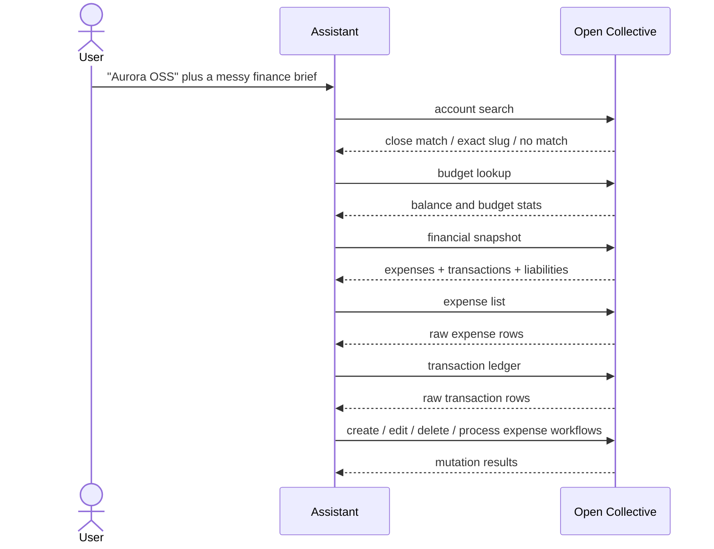

# Open Collective Accounting Gauntlet

This scenario is a hard-level, mock Open Collective brief meant to stress the accounting toolchain end-to-end.

## Scenario Brief

The assistant is dropped into a messy finance handoff for the fictional `Aurora Open Source Collective`. The operator gives a nickname instead of a slug, references duplicate invoices, wants a budget health check, and asks for a mix of read-only ledger browsing plus mutation actions.

The goal is to force the assistant to:

1. Resolve the account from a human label.
2. Confirm the exact slug before any ledger action.
3. Pull a full financial snapshot.
4. Browse raw expenses and transaction history.
5. Check budget health separately.
6. Exercise every mutation path with explicit audit-style messaging.

## Tool Coverage

| Tool | Why it appears in the scenario |
| --- | --- |
| `accounting_account_search` | Resolves the nickname and also handles no-match and close-match cases. |
| `accounting_budget_lookup` | Separates budget health from the broader snapshot. |
| `accounting_financial_snapshot` | Summarizes open liabilities, recent expenses, and recent transactions. |
| `accounting_expense_list` | Browses the raw expense ledger. |
| `accounting_transaction_all` | Browses the raw transaction ledger. |
| `accounting_expense_workflow` | Covers the high-level create/edit/delete/process workflow. |
| `accounting_expense_create` | Exercises the granular create mutation. |
| `accounting_expense_update` | Exercises the granular edit mutation. |
| `accounting_expense_delete` | Exercises the granular delete mutation. |
| `accounting_expense_process` | Exercises the granular approval/payment mutation. |

## Mock Narrative

The collective has:

- a recurring cloud-hosting invoice that is pending approval,
- a duplicate catering expense that should be removed,
- a grant payout that needs approval,
- a corrected reimbursement that needs an edit,
- and a recent donation spike that should show up in the transaction ledger.

The fixture is intentionally mixed with:

- exact matches,
- close matches,
- unresolved names,
- budget lookup retries,
- multi-status expense rows,
- and a full mutation chain.

That combination makes the test useful for both routing and payload-shaping behavior.

## Suggested Assistant Flow

## Fixture Location

The mock payload lives at:

- [`mock/opencollective-accounting-gauntlet.json`](../../mock/opencollective-accounting-gauntlet.json)
